# Project 3: Backstepping and Adaptive Backstepping for a 3-DOF Planar Manipulator

This project applies backstepping control to high-precision end-effector tracking on a fully-actuated three-link planar manipulator with full rigid-body dynamics

$$M(q)\,\ddot q + C(q,\dot q)\,\dot q + G(q) + D\,\dot q = \tau.$$

Four controllers are compared in two scenarios that stress different aspects of robustness:

- a **nominal** scenario in which the link masses assumed by the controllers match the plant,
- a **payload** scenario in which the real third-link mass is tripled while the controllers keep using the nominal mass model.

The four controllers are

- `backstepping_full` — backstepping with the full $M(q), C(q,\dot q), G(q)$ feedforward,
- `backstepping_simp` — simplified backstepping that drops $C(q,\dot q)\dot q$ and uses only the diagonal of $M(q)$,
- `adaptive_simp` — adaptive backstepping that estimates link masses online through a gravity regressor,
- `adaptive` — the Slotine-Li adaptive controller carried over from Project 2 as a deliberately wrong-tool baseline.

The mandatory Project 2+ comparison (§10 of the course requirements) is realised by examining all eight cases (four controllers × two scenarios).

## Quick Visual Summary

Animations are organised under `animations/comparison/{nominal,payload}/`. Each scenario has one GIF per controller.

| Nominal scenario | Payload scenario (m₃ × 3) |
|---|---|
| 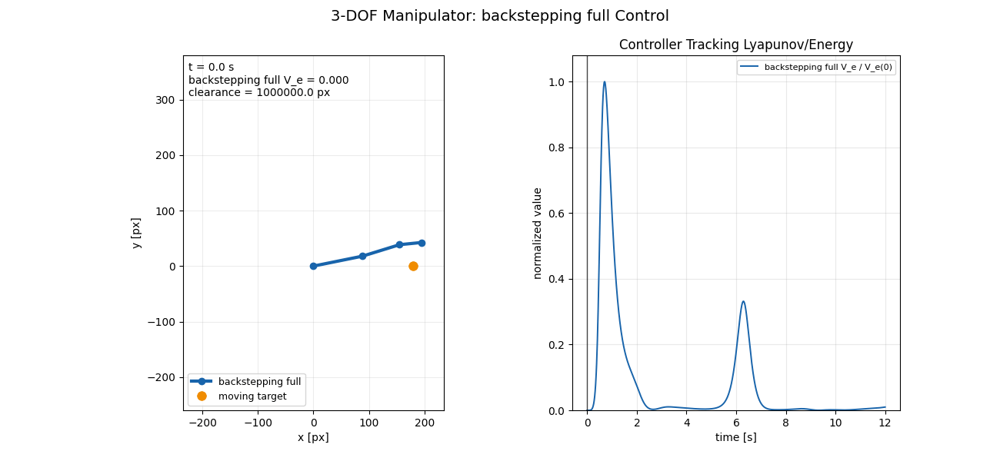 | 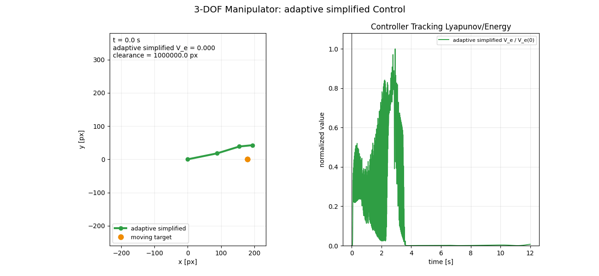 |
| `backstepping_full` follows the reachable ellipse essentially perfectly. | `adaptive_simp` recovers a usable tracking performance even though the third-link mass is unknown and tripled. |

The full set of eight animations is in `animations/comparison/`.

## Result Summary

The headline metric is the tail-window mean of the joint tracking error norm $\|z_1\|$ over the last 2 seconds. The success-fraction column uses an end-effector error threshold of 10 px. The tracking Lyapunov candidate is $V_e = \tfrac{1}{2}(\|z_1\|^2 + \|z_2\|^2)$.

| Scenario | Controller | Tail mean $\|z_1\|$ [rad] | Tail success | Final $V_e$ | RMS torque [Nm] |
|---|---|---:|---:|---:|---:|
| nominal | `backstepping_full` | **0.011** | **1.00** | **0.020** | 7.32 |
| nominal | `backstepping_simp` | **0.008** | **1.00** | **0.006** | 37.77 |
| nominal | `adaptive_simp` | 0.304 | 0.42 | 5.11 | 52.73 |
| nominal | `adaptive` | 2.264 | 0.00 | 417.5 | 104.99 |
| payload | `backstepping_full` | 1.087 | 0.00 | 98.0 | 14.70 |
| payload | `backstepping_simp` | 1.231 | 0.00 | 105.1 | 39.00 |
| payload | `adaptive_simp` | **0.196** | **0.77** | **7.01** | 50.62 |
| payload | `adaptive` | 2.110 | 0.00 | 496.0 | 104.61 |

Main conclusions:

- In the nominal scenario both backstepping variants achieve essentially perfect tracking, with $\|z_1\|$ at the $10^{-2}$ rad level. The simplified variant is slightly tighter than the full one because its lower-amplitude torques interact well with the small Coriolis terms at the chosen reference speed; the closed-loop performance gain is incidental, not structural.
- The payload scenario inverts the ranking. The two backstepping controllers degrade by two orders of magnitude in $V_e$ because they keep feeding forward the wrong gravity and inertia terms. The adaptive-backstepping variant `adaptive_simp` is the only one that recovers usable tracking, because it adapts the link-mass estimates through the gravity regressor.
- The Slotine-Li adaptive controller fails in both scenarios. Its plant model (diagonal joint-space dynamics with constant bias) does not describe the full $M(q), C(q,\dot q), G(q)$ physics of this project, so the adaptation laws drive its parameter estimates away from any physically meaningful value. It is included as a deliberate wrong-tool baseline to motivate the methodological move to backstepping.
- Persistent excitation is not provided by the elliptical reference, so the adaptive-backstepping mass estimates do not converge to the true masses (they drift towards the configured bounds via projection). This is consistent with classical adaptive-control theory: tracking is guaranteed without persistent excitation, parameter identification is not.

## Repository Layout

```text
.
├── README.md                              # this file
├── LICENSE                                # MIT
├── requirements.txt                       # numpy, scipy, matplotlib, pillow
├── pyproject.toml                         # project metadata
├── main.py                                # root launcher that calls src.main.main()
├── simplified_backstepping_demo.py        # standalone scipy/solve_ivp demo
├── configs/
│   └── default.json                       # full hyperparameter set
├── src/                                   # main four-way comparison code
│   ├── __init__.py
│   ├── config.py
│   ├── system.py
│   ├── controller.py
│   ├── simulation.py
│   ├── visualisation.py
│   └── main.py
├── ppo/                                   # earlier standalone backstepping demo
│   ├── __init__.py
│   ├── config.py
│   ├── physics_robot.py
│   └── backstepping_tracking.py
├── figures/
│   ├── comparison/
│   │   ├── nominal/                       # 7 PNGs from main.py
│   │   └── payload/                       # 7 PNGs from main.py
│   ├── backstepping_tracking/             # PNGs from ppo/backstepping_tracking.py
│   └── simplified_backstepping/           # PNGs from simplified_backstepping_demo.py
├── animations/
│   ├── comparison/
│   │   ├── nominal/                       # 4 GIFs (one per controller)
│   │   └── payload/                       # 4 GIFs (one per controller)
│   ├── backstepping_tracking/             # manipulator_tracking.gif
│   └── simplified_backstepping/           # simplified_tracking.gif
├── data/
│   ├── comparison/
│   │   ├── nominal/                       # rollouts.csv, summary.csv
│   │   └── payload/                       # rollouts.csv, summary.csv
│   ├── backstepping_tracking/             # simulation_log.npz
│   └── simplified_backstepping/           # simulation_log.npz
└── notes/
    └── project_1_stability.md             # historical, kept for reference
```

Code responsibilities:

| File | Responsibility |
|---|---|
| `src/system.py` | Manipulator kinematics, full rigid-body dynamics $M(q), C(q,\dot q), G(q)$, RK4 integration with sub-stepping, payload-perturbation helper. |
| `src/controller.py` | Reference generator and the four controllers used in this project. |
| `src/simulation.py` | Closed-loop rollout, metrics, CSV export, Lyapunov values. |
| `src/visualisation.py` | Figures and per-controller GIF animations. |
| `src/config.py` | Typed dataclasses for hyperparameters; `default_config()` factory and `load_config()` JSON loader. |
| `src/main.py` | CLI orchestration: runs both scenarios, generates artifacts. |
| `main.py` | Root launcher that calls `src.main.main()`. |
| `simplified_backstepping_demo.py` | Standalone demo using scipy `solve_ivp` and a simpler plant $M_{\text{diag}}\ddot q + G(q) = \tau$. |
| `ppo/backstepping_tracking.py` | Earlier standalone numba-accelerated full-physics backstepping demo, kept for historical reproducibility. |

## 1. Problem Definition

### Control task

The end-effector of a three-link, fully-actuated planar manipulator must track a time-varying reference trajectory in workspace coordinates. The reference is a closed ellipse at a fixed centre; the requested ellipse is automatically scaled to the largest reachable ellipse inside the manipulator's workspace, and the actual joint-space reference $q_d(t), \dot q_d(t), \ddot q_d(t)$ is obtained from the scaled ellipse through closed-form inverse kinematics with a configurable elbow sign and tool orientation. The joint-space reference is the input to all controllers.

### Plant class

The simulated plant is a fully-actuated rigid-body manipulator in joint space:

$$M(q)\,\ddot q + C(q,\dot q)\,\dot q + G(q) + D\,\dot q = \tau + w(t),$$

where $M(q)$ is the symmetric positive-definite inertia matrix, $C(q,\dot q)\dot q$ collects Coriolis and centrifugal forces, $G(q)$ is the gravity vector, $D$ is a diagonal viscous-friction matrix, $\tau$ is the joint-torque control input, and $w(t)$ is an optional bounded disturbance (set to zero in the committed runs). The integration uses a fourth-order Runge–Kutta scheme with adaptive sub-stepping (sub-step $\leq 0.5$ ms).

### Assumptions

- The full state $x = [q^\top\ \dot q^\top]^\top \in \mathbb{R}^6$ is available for feedback.
- Link lengths and geometry are perfectly known; only the link masses may differ between the controller's model and the true plant (this is the payload scenario).
- Joint torques are saturated to configured limits inside the simulator (`np.clip` before integration); the saturation is not modelled in the formal stability arguments.
- No sensor noise, measurement delay, or actuator dynamics are simulated.

### Class of methods

Two related Lyapunov-based design ideas from the Advanced Control Methods course are used:

1. **Backstepping** with full or simplified model feedforward, for the nominal case in which the controller's model matches the plant.
2. **Adaptive backstepping** with a parameter regressor for the link masses, for the case in which the masses are unknown or perturbed.

A Slotine-Li adaptive controller designed for a different (diagonal joint-space) plant class is included as a deliberately wrong-tool baseline.

## 2. System Description

### Geometry

The manipulator has three revolute joints and link lengths

$$L = [90,\, 70,\, 40]\ \text{px}.$$

Pixel units are converted to metres inside the dynamics by dividing by 200, so the physical link lengths are $L_m = [0.45,\, 0.35,\, 0.20]$ m. The base is at the origin. Each link has its centre of mass at its midpoint and a thin-rod inertia $I_i = \tfrac{1}{12} m_i L_{m,i}^2$.

For joint $k$ define the cumulative angle $\alpha_k(q) = \sum_{\ell=1}^{k} q_\ell$. The forward kinematics for the position at the end of link $i$ are

$$p_i(q) = \sum_{k=1}^{i} L_k \begin{bmatrix} \cos \alpha_k(q) \\ \sin \alpha_k(q) \end{bmatrix},\qquad i=1,2,3.$$

The end-effector position is $p_3(q)$.

### State, input, constraints

| Quantity | Symbol | Range or units |
|---|---|---|
| Joint angles | $q \in \mathbb{R}^3$ | rad, wrapped to $(-\pi, \pi]$ |
| Joint velocities | $\dot q \in \mathbb{R}^3$ | rad/s, clipped to $[-15, 15]$ inside the simulator for numerical safety |
| Control input | $\tau \in \mathbb{R}^3$ | Nm, clipped to $\pm[80, 60, 40]$ |
| Link masses (true) | $m \in \mathbb{R}^3$ | kg, $[1.0, 0.7, 0.6]$ nominally |
| Damping | $D = \mathrm{diag}(d_1,d_2,d_3)$ | $[0.08, 0.06, 0.05]$ |
| Gravity | $g$ | $9.81$ m/s² |

### Equations of dynamics

The inertia matrix entries (derived from the standard planar-3R energy method) are

$$M_{33} = I_3 + m_3 \ell_{c3}^2$$

$$M_{23} = M_{33} + m_3 L_{m,2}\, \ell_{c3} \cos q_3$$

$$M_{13} = M_{33} + m_3 L_{m,2}\, \ell_{c3}\cos q_3 + m_3 L_{m,1}\, \ell_{c3}\cos(q_2+q_3)$$

$$M_{22} = I_2 + m_2 \ell_{c2}^2 + I_3 + m_3\bigl(L_{m,2}^2 + \ell_{c3}^2 + 2 L_{m,2}\ell_{c3}\cos q_3\bigr)$$

$$M_{12} = M_{22} + (m_2 L_{m,1}\ell_{c2} + m_3 L_{m,1} L_{m,2})\cos q_2 + m_3 L_{m,1}\ell_{c3}\cos(q_2+q_3)$$

$$\begin{aligned}M_{11} = \;&I_1 + m_1 \ell_{c1}^2 + m_2\bigl(L_{m,1}^2 + \ell_{c2}^2 + 2 L_{m,1}\ell_{c2}\cos q_2\bigr) \\ &+ m_3\bigl(L_{m,1}^2 + L_{m,2}^2 + \ell_{c3}^2 + 2 L_{m,1} L_{m,2} \cos q_2 + 2 L_{m,2}\ell_{c3}\cos q_3 + 2 L_{m,1}\ell_{c3}\cos(q_2+q_3)\bigr)\end{aligned}$$

with $M$ symmetric: $M_{ji} = M_{ij}$. Here $\ell_{ci} = L_{m,i}/2$ is the centre-of-mass distance along link $i$.

The gravity vector is

$$G_3 = m_3\, g\, \ell_{c3} \cos(q_1+q_2+q_3)$$

$$G_2 = (m_2 \ell_{c2} + m_3 L_{m,2})\, g \cos(q_1+q_2) + G_3$$

$$G_1 = (m_1 \ell_{c1} + (m_2+m_3) L_{m,1})\, g \cos(q_1) + G_2.$$

The Coriolis vector $c(q,\dot q) = C(q,\dot q)\dot q$ is built in `src/system.py` (`_coriolis_vector`). Its entries are derived from the Christoffel symbols of $M$, so the skew-symmetry property $\dot M - 2C = -(\dot M - 2C)^\top$ holds by construction. This property is the foundation of the canonical mechanical-system Lyapunov argument; the present implementation uses an unweighted simplification (Section 4.1).

### Reference trajectory

The requested end-effector trajectory is the ellipse

$$p_r(t) = c_e + \begin{bmatrix} a_x \cos(\omega t) \\ a_y \sin(\omega t) \end{bmatrix},\quad c_e = (60, 0),\ a_x = 165,\ a_y = 45,\ \omega = 0.7\ \text{rad/s}.$$

If the requested ellipse extends outside the manipulator's reachable workspace, the code (`ppo/backstepping_tracking.py`, function `ellipse_workspace_scale`) samples the ellipse at 720 points and finds the largest uniform scale $s \in (0, 1]$ for which the whole ellipse is reachable for the configured elbow sign and tool orientation. The scaled and projected ellipse $p_d^{\text{ee}}(t)$ is then inverted to joint-space using closed-form planar-3R inverse kinematics (`inverse_kinematics_3dof`), and $\dot q_d, \ddot q_d$ are obtained by central differences with `derivative_dt = 1e-4` s.

### Payload perturbation

The payload scenario (`--payload`, or `SIMULATE_PAYLOAD_ERROR=True` in the config) replaces the true plant dynamics with one in which the third-link mass $m_3$ and its inertia are multiplied by `PAYLOAD_MULTIPLIER = 3.0`. The controllers, however, continue to use the nominal masses. This creates a structural model mismatch in $M(q)$ and $G(q)$ of about a factor 3 in the third joint, which feedforward-only controllers cannot reject.

## 3. Mathematical Specification

The notation below is used consistently across the rest of the README, the code, and the plots. Each symbol is introduced once and never reused with another meaning.

| Symbol | Meaning | Code variable |
|---|---|---|
| $q \in \mathbb{R}^3$ | joint angles | `q` |
| $\dot q,\ \ddot q \in \mathbb{R}^3$ | joint velocities, accelerations | `dq`, `ddq` |
| $q_d, \dot q_d, \ddot q_d$ | desired joint trajectory | `ReferenceState.q`, `.dq`, `.ddq` |
| $z_1 = q - q_d$ | position tracking error | `ControlInfo.q_error` |
| $\alpha = \dot q_d - K_1 z_1$ | virtual control (desired $\dot q$) | implicit in `_backstepping_errors` |
| $z_2 = \dot q - \alpha$ | velocity error w.r.t. virtual control | `ControlInfo.sliding_error` |
| $\dot\alpha = \ddot q_d - K_1 (\dot q - \dot q_d)$ | time derivative of $\alpha$ | computed inline |
| $\tau \in \mathbb{R}^3$ | applied joint torques | `Rollout.tau` |
| $\tau_{\text{raw}}$ | commanded torque before saturation | `Rollout.tau_raw` |
| $M(q), C(q,\dot q), G(q)$ | full rigid-body matrices | `manipulator_terms()` |
| $M_{\text{diag}}(m)$ | diagonal of $M(q)$ | inside `BacksteppingSimplified`, `AdaptiveSimplifiedController` |
| $K_1, K_2 \in \mathbb{R}^{3\times 3}$ | backstepping diagonal positive gains | `backstepping_controller.k1`, `.k2` |
| $m = [m_1, m_2, m_3]^\top$ | true link masses | `dynamics.link_masses` |
| $\hat m,\ \tilde m = \hat m - m$ | mass estimate and error | `ControlInfo.mass_hat` |
| $Y_g(q)$ | gravity regressor, $G(q,m) = Y_g(q)\, m$ | `_gravity_mass_regressor` |
| $\Gamma_m$ | adaptation gain matrix for masses | `adaptive_controller.gamma_mass` |
| $\Gamma_D$ | adaptation gain matrix for damping | `adaptive_controller.gamma_damping` |
| $V$ | non-augmented Lyapunov candidate | `Rollout.tracking_lyapunov` |
| $V_a$ | augmented (parameter-error including) Lyapunov candidate | `Rollout.augmented_lyapunov` |

## 4. Method Description

### 4.1 Backstepping design (nominal case)

The plant is a chain of two integrators: the joint velocity $\dot q$ governs how $q$ evolves, and $\tau$ governs how $\dot q$ evolves through $M(q)$. Backstepping is the systematic Lyapunov-based design that handles such cascaded structures.

**Step 1 — position-error subsystem with virtual control.**

Define the position tracking error

$$z_1 = q - q_d.$$

Its dynamics are $\dot z_1 = \dot q - \dot q_d$. If $\dot q$ were a free control input, choosing $\dot q = \alpha(z_1, t)$ with

$$\alpha(z_1, t) = \dot q_d - K_1 z_1, \qquad K_1 = K_1^\top \succ 0,$$

would give $\dot z_1 = -K_1 z_1$, which is exponentially stable. The function $\alpha$ is the *virtual control* for the position-error subsystem.

**Step 2 — velocity-error layer.**

Because $\dot q$ is not the real control, define

$$z_2 = \dot q - \alpha,$$

so that

$$\dot z_1 = \dot q - \dot q_d = z_2 + \alpha - \dot q_d = z_2 - K_1 z_1.$$

The position-error subsystem is now an exponentially stable system driven by $z_2$; if $z_2 \to 0$, then $z_1 \to 0$.

**Step 3 — velocity-error dynamics.**

Differentiating $z_2$ and using $M\ddot q = \tau - C\dot q - G$,

$$\dot z_2 = \ddot q - \dot\alpha = M(q)^{-1}\bigl[\tau - C(q,\dot q)\dot q - G(q)\bigr] - \dot\alpha,$$

where $\dot\alpha = \ddot q_d - K_1 \dot z_1 = \ddot q_d - K_1(\dot q - \dot q_d)$ is a known signal.

**Step 4 — Lyapunov candidate.**

Take

$$V = \tfrac{1}{2}\, z_1^\top z_1 + \tfrac{1}{2}\, z_2^\top z_2.$$

*Approximation note.* The canonical backstepping derivation for mechanical systems weights $z_2$ by $M(q)$:

$$V_{\text{canonical}} = \tfrac{1}{2}z_1^\top z_1 + \tfrac{1}{2}\,z_2^\top M(q)\, z_2,$$

and exploits the skew-symmetry of $\dot M - 2C$ for cancellation. The present implementation uses the unweighted form for simplicity: it costs a clean energy interpretation but yields the same closed-loop result once the control law is chosen accordingly. This is stated explicitly to satisfy the "no hidden approximations" rule (§5 of the course requirements).

**Step 5 — derivative of $V$.**

$$\dot V = z_1^\top \dot z_1 + z_2^\top \dot z_2 = z_1^\top (z_2 - K_1 z_1) + z_2^\top \bigl[ M^{-1}(\tau - C\dot q - G) - \dot\alpha \bigr].$$

Expanding,

$$\dot V = -z_1^\top K_1 z_1 + z_1^\top z_2 + z_2^\top \bigl[ M^{-1}(\tau - C\dot q - G) - \dot\alpha \bigr].$$

**Step 6 — control choice.**

We want the cross-term $z_1^\top z_2$ to be cancelled and the $z_2$-bracket to deliver an additional negative-definite contribution $-z_2^\top K_2 z_2$. This holds if

$$M^{-1}(\tau - C\dot q - G) - \dot\alpha = -z_1 - K_2 z_2, \qquad K_2 = K_2^\top \succ 0,$$

equivalently

$$\boxed{\;\tau = M(q)\bigl(\dot\alpha - z_1 - K_2 z_2\bigr) + C(q,\dot q)\dot q + G(q).\;}$$

This is the **backstepping torque law**. It is exactly the formula implemented in `BacksteppingFull.compute` (`src/controller.py`).

**Step 7 — closed-loop $\dot V$ and asymptotic tracking.**

Substituting the chosen $\tau$ back,

$$\dot V = -z_1^\top K_1 z_1 - z_2^\top K_2 z_2 \le 0,$$

with equality only at $z_1 = z_2 = 0$. By LaSalle's invariance principle (or Barbalat's lemma, since the reference is time-varying), $z_1(t) \to 0$ and $z_2(t) \to 0$. From $z_2 \to 0$ and $\dot z_1 = z_2 - K_1 z_1$, $\dot q \to \dot q_d$. Hence **asymptotic joint-space tracking is guaranteed** under the standing assumptions (full state available, exact $M, C, G$, no torque saturation).

### 4.2 Simplified backstepping

`BacksteppingSimplified` drops two pieces of model information:

- the Coriolis term $C(q,\dot q)\dot q$ is set to zero,
- only the diagonal entries of $M(q)$ are kept.

The torque law becomes

$$\tau = M_{\text{diag}}(q)\bigl(\dot\alpha - z_1 - K_2 z_2\bigr) + G(q).$$

For this approximation to behave like a backstepping controller, the Coriolis term must be small along the trajectory and the off-diagonal coupling in $M(q)$ must not dominate. On the configured ellipse at $\omega = 0.7$ rad/s with masses of order $1$ kg, both conditions hold reasonably well in the nominal scenario; the closed-loop $\dot V$ is no longer guaranteed to be negative definite pointwise but stays negative on average. Under model mismatch (payload scenario) the missing terms can no longer be assumed small and the controller degrades.

### 4.3 Adaptive backstepping with a gravity regressor

`AdaptiveSimplifiedController` handles unknown link masses while reusing the simplified plant model $M_{\text{diag}}\ddot q + G(q,m) = \tau$ (with $C = 0$). The key structural fact is that **$G(q, m)$ is linear in the mass vector** $m$:

$$G(q, m) = Y_g(q)\, m, \qquad Y_g(q) \in \mathbb{R}^{3\times 3}.$$

The columns of $Y_g(q)$ are obtained by computing $G(q, e_i)$ for the canonical mass vectors $e_i \in \mathbb{R}^3$; this is exactly what `_gravity_mass_regressor` does in the code.

Let $\hat m(t)$ be the running mass estimate, $\tilde m = \hat m - m$ the parameter error, and $\Gamma_m = \Gamma_m^\top \succ 0$ a chosen adaptation gain. The control law is

$$\tau = M_{\text{diag}}(\hat m)\bigl(\dot\alpha - z_1 - K_2 z_2\bigr) + \hat D \dot q + G(q, \hat m),$$

i.e. the simplified backstepping law evaluated at the *current estimates*. (The code also adapts the diagonal damping $D$; the mass-only derivation is shown below for clarity, the damping case is structurally identical.)

**Augmented Lyapunov candidate.**

$$V_a = \tfrac{1}{2}\, z_1^\top z_1 + \tfrac{1}{2}\, z_2^\top z_2 + \tfrac{1}{2}\, \tilde m^\top \Gamma_m^{-1}\, \tilde m.$$

**Derivation of $\dot V_a$.**

The first two terms behave as in Section 4.1 except that the backstepping cancellation now leaves a residual gravity parameter error. Writing $G(q, \hat m) - G(q, m) = Y_g(q)\, \tilde m$, the $z_2$-dynamics become

$$M_{\text{diag}}\, \dot z_2 = -M_{\text{diag}}\, z_1 - M_{\text{diag}}\, K_2 z_2 - Y_g(q)\, \tilde m,$$

so

$$\dot V_a = -z_1^\top K_1 z_1 - z_2^\top K_2 z_2 - z_2^\top Y_g(q)\, \tilde m + \tilde m^\top \Gamma_m^{-1}\, \dot{\hat m}.$$

(The parameter error has constant time derivative $\dot{\tilde m} = \dot{\hat m}$ because $m$ is constant.)

**Adaptation law derivation.**

The parameter-error terms cancel iff the last two summands sum to zero:

$$\tilde m^\top \Gamma_m^{-1}\, \dot{\hat m} - z_2^\top Y_g(q)\, \tilde m = 0 \quad\Longleftrightarrow\quad \tilde m^\top \bigl( \Gamma_m^{-1}\, \dot{\hat m} - Y_g(q)^\top z_2 \bigr) = 0.$$

For this to hold for every realisation of $\tilde m$, the bracket must vanish, giving the **adaptation law**

$$\boxed{\;\dot{\hat m} = -\Gamma_m\, Y_g(q)^\top z_2.\;}$$

This is the formula implemented as

```python
self.mass_hat = np.clip(
    mass_hat + dt * (-self.cfg.gamma_mass * (gravity_regressor.T @ z2)),
    self.cfg.mass_bounds[0],
    self.cfg.mass_bounds[1],
)
```

in `AdaptiveSimplifiedController.compute`. With this law,

$$\dot V_a = -z_1^\top K_1 z_1 - z_2^\top K_2 z_2 \le 0.$$

**Conclusion.** By LaSalle/Barbalat, $z_1(t) \to 0$ and $z_2(t) \to 0$, so **tracking is asymptotic even with unknown masses**. The parameter error $\tilde m$ is only guaranteed to be bounded; convergence $\hat m \to m$ additionally requires persistent excitation, which is not provided by the elliptical reference. The implementation also clips $\hat m$ into configured bounds (projection method) to prevent drift caused by discrete-time effects.

### 4.4 The Slotine-Li adaptive baseline (wrong-tool case)

`AdaptiveLyapunovController` was designed in Project 2 for a different plant class: diagonal joint-space dynamics $H\ddot q + D\dot q = \tau + b$ with unknown constant scalars $H_i, D_i, b_i$. Its torque law

$$\tau = \hat H\, \ddot q_r + \hat D\, \dot q - \hat b - K_s s,\quad s = \dot e + \lambda e,\quad e = q - q_d,$$

and its adaptation laws assume this structure. When applied to the present full $M(q), C(q,\dot q), G(q)$ plant, those structural assumptions are violated: the true plant has off-diagonal couplings, configuration-dependent inertia, and a configuration-dependent gravity term, none of which the Project-2 controller can represent. The adaptation laws still update $\hat H, \hat D, \hat b$, but they push these scalars in directions that do not minimise tracking error in the true plant. This controller is included as a deliberate negative example to motivate the methodological move to backstepping for this project class.

## 5. Algorithm Listing

The same outer loop applies to all four controllers; only the torque law and the (optional) parameter update step differ. Pseudocode for a single rollout:

```text
Input: configuration cfg, controller C, real dynamics D_real
1.  Initialise arm geometry, planner, plant from cfg; plant uses D_real
2.  Reset controller state (parameter estimates, etc.)
3.  Build time grid t_0, t_1, ..., t_N with step dt
4.  for k = 0 to N:
5.      ref ← planner.step(t_k, dt)               // computes q_d, q̇_d, q̈_d
6.      q, q̇ ← plant state
7.      Compute the backstepping errors:
            z₁ ← q − q_d
            α  ← q̇_d − K₁ z₁
            z₂ ← q̇ − α
            α̇  ← q̈_d − K₁ (q̇ − q̇_d)
8.      Compute torque according to controller C:
            BacksteppingFull:        τ = M(q) (α̇ − z₁ − K₂ z₂) + C(q, q̇) q̇ + G(q)
            BacksteppingSimplified:  τ = M_diag(q) (α̇ − z₁ − K₂ z₂) + G(q)
            AdaptiveSimplified:      τ = M_diag(q, m̂) (α̇ − z₁ − K₂ z₂) + D̂ q̇ + G(q, m̂)
            AdaptiveLyapunov:        τ = Ĥ q̈_r + D̂ q̇ − b̂ − K_s s,
                                          s   = (q̇ − q̇_d) + λ (q − q_d),
                                          q̈_r = q̈_d − λ (q̇ − q̇_d)
9.      Clip τ to actuator bounds: τ ← clip(τ_raw, −τ_max, τ_max)
10.     If controller is adaptive, update estimates:
            AdaptiveSimplified:  m̂ ← m̂ + dt · (−Γ_m  Y_g(q)ᵀ z₂)
                                 D̂ ← D̂ + dt · (−Γ_D · z₂ ⊙ q̇)
                                 followed by projection into bounds
            AdaptiveLyapunov:    Ĥ, D̂, b̂ updated as in Project 2
11.     Log all signals; advance the plant by RK4 with sub-stepping (sub-step ≤ 0.5 ms)
12. end for
13. Compute Lyapunov candidates V_e (all controllers) and V_a (adaptive only)
14. Compute summary metrics: tail mean errors, success fraction, torque RMS, saturation fraction
15. Export rollouts.csv, summary.csv, PNG plots, per-controller GIF
```

The driver in `src/main.py` runs the above loop for each (controller, scenario) pair and writes the artifacts into the directory tree shown in the Repository Layout section.

## 6. Experimental Setup

### Simulation parameters

| Quantity | Value |
|---|---:|
| integration step `dt` | 0.01 s |
| RK4 sub-step inside `JointSpacePlant.step` | $\leq 0.5$ ms |
| total duration | 12.0 s |
| tail window for metrics | 2.0 s (last 200 samples) |
| target threshold for success fraction | 10 px end-effector distance |

### Initial conditions

| Quantity | Value |
|---|---|
| initial joint angles $q(0)$ | $[0.2,\, 0.1,\, -0.2]$ rad |
| initial joint velocities $\dot q(0)$ | $[0, 0, 0]$ rad/s |
| initial mass estimates $\hat m(0)$ | $[1.0,\, 0.7,\, 0.6]$ kg |
| initial damping estimates $\hat D(0)$ | $[0.08,\, 0.06,\, 0.05]$ |
| initial estimates for Slotine-Li baseline $\hat H(0),\hat D(0), \hat b(0)$ | $[1.2,\, 0.8,\, 0.45],\ [0.08,\, 0.06,\, 0.05],\ [0,0,0]$ |

### Reference trajectory

| Quantity | Value |
|---|---|
| centre of requested ellipse | $(60, 0)$ px |
| requested semi-axes $(a_x, a_y)$ | $(165, 45)$ px |
| angular rate $\omega$ | $0.7$ rad/s |
| ellipse orientation | $0$ rad |
| elbow sign | $+1$ |
| workspace margin | $2$ px |
| derivative step for IK differentiation | $10^{-4}$ s |

The requested ellipse is automatically scaled by the maximum sampled factor $s \in (0, 1]$ for which the whole ellipse is reachable. With the configured link lengths and elbow sign, $s < 1$, and the reachable ellipse fits well inside the workspace.

### Controller gains

| Controller | Parameter | Value |
|---|---|---:|
| `BacksteppingFull`, `BacksteppingSimplified` | $K_1$ | $\mathrm{diag}(10, 10, 10)$ |
| `BacksteppingFull`, `BacksteppingSimplified` | $K_2$ | $\mathrm{diag}(10, 10, 10)$ |
| `BacksteppingFull`, `BacksteppingSimplified` | assumed link masses | $[1.0,\, 0.7,\, 0.6]$ kg |
| `AdaptiveSimplifiedController` | $K_1, K_2$ | inherited, $\mathrm{diag}(10, 10, 10)$ |
| `AdaptiveSimplifiedController` | $\Gamma_m$ | $\mathrm{diag}(0.08, 0.08, 0.08)$ |
| `AdaptiveSimplifiedController` | $\Gamma_D$ | $\mathrm{diag}(0.5, 0.5, 0.5)$ |
| `AdaptiveSimplifiedController` | mass bounds | $[0.05,\, 3.0]$ kg |
| `AdaptiveSimplifiedController` | damping bounds | $[0.0,\, 2.0]$ |
| `AdaptiveLyapunovController` | $\lambda$ | $6.0$ |
| `AdaptiveLyapunovController` | sliding gain $K_s$ | $\mathrm{diag}(18, 16, 12)$ |
| `AdaptiveLyapunovController` | $\Gamma_{\text{inertia}},\Gamma_{\text{damping}},\Gamma_{\text{bias}}$ | $\mathrm{diag}(0.8),\mathrm{diag}(0.5),\mathrm{diag}(0.4)$ |
| All | torque limits | $[80, 60, 40]$ Nm |

All numerical values are read from `configs/default.json` and (for compatibility with direct Python use) reproduced by `default_config()` in `src/config.py`.

### Scenarios

| Scenario | What the controllers assume | What the plant uses |
|---|---|---|
| nominal | masses $= [1.0,\, 0.7,\, 0.6]$ kg | masses $= [1.0,\, 0.7,\, 0.6]$ kg |
| payload | masses $= [1.0,\, 0.7,\, 0.6]$ kg | masses $= [1.0,\, 0.7,\, \mathbf{1.8}]$ kg, third-link inertia $\times 3$ |

The third link is the only one whose mass and inertia are scaled (by `PAYLOAD_MULTIPLIER = 3.0` in the config). All other parameters, including damping and torque limits, remain identical between the two scenarios.

No external disturbance torque $w(t)$ is injected in either scenario (`disturbance_amplitude = 0`). Model mismatch between controller and plant is the only source of imperfection.

## 7. Reproducibility

### Install

```bash
pip install -r requirements.txt
```

The dependency set is small: `numpy`, `scipy`, `matplotlib`, `pillow`.

### Reproduce the full comparison

```bash
python main.py
```

This runs all four controllers in both the nominal and payload scenarios, writes the per-scenario CSVs, PNGs, and per-controller GIFs, and prints a summary line per controller. Expected runtime on a single CPU core: about 1–2 minutes per scenario.

### Run a single controller or a single scenario

```bash
# Only the full backstepping controller, only the nominal scenario
python main.py --controller backstepping_full --nominal-only

# All four controllers, only the payload scenario
python main.py --payload

# Single adaptive simplified, both scenarios
python main.py --controller adaptive_simp
```

Available `--controller` values: `adaptive`, `adaptive_simp`, `backstepping_full`, `backstepping_simp`, `all` (default).

### Reproduce the standalone backstepping demo

```bash
python -m ppo.backstepping_tracking
```

This runs the earlier numba-accelerated full-physics demo on the same elliptical reference. Outputs land in `figures/backstepping_tracking/`, `animations/backstepping_tracking/`, `data/backstepping_tracking/`.

### Reproduce the simplified-model standalone demo

```bash
python simplified_backstepping_demo.py
```

This script uses `scipy.integrate.solve_ivp` with the simplified plant $M_{\text{diag}}\ddot q + G(q) = \tau$ ($C = 0$) and the simplified backstepping torque law $\tau = M_{\text{diag}}(\dot\alpha - z_1 - K_2 z_2) + G(q)$. It is useful as a sanity check on the methodology in isolation. Outputs land in `figures/simplified_backstepping/`, `animations/simplified_backstepping/`, `data/simplified_backstepping/`.

### Produced outputs

| Path | What it contains |
|---|---|
| `figures/comparison/{scenario}/workspace_trajectories.png` | reachable ellipse, end-effector path of the first rollout, final arm poses of all four controllers |
| `figures/comparison/{scenario}/tracking_errors.png` | end-effector target error and joint tracking-error norm for all controllers |
| `figures/comparison/{scenario}/joint_tracking_errors_z1.png` | per-joint $z_1$ traces for all controllers |
| `figures/comparison/{scenario}/lyapunov_values.png` | augmented $V_a$ for adaptive controllers (log scale) and $V_e$ for all controllers |
| `figures/comparison/{scenario}/adaptive_parameter_estimates.png` | Slotine-Li parameter traces |
| `figures/comparison/{scenario}/adaptive_simp_parameter_estimates.png` | adaptive backstepping mass, damping, inertia traces |
| `figures/comparison/{scenario}/control_and_clearance.png` | torques and minimum clearance signal |
| `animations/comparison/{scenario}/{controller}.gif` | per-controller scene animation |
| `data/comparison/{scenario}/rollouts.csv` | time-aligned per-controller samples (q, $\dot q$, $q_d$, $\tau$, estimates, errors, Lyapunov) |
| `data/comparison/{scenario}/summary.csv` | aggregate metrics per controller |

Each scenario in `{nominal, payload}` produces the same file set.

## 8. Results: Nominal Scenario

Plots in this section come from `figures/comparison/nominal/`.

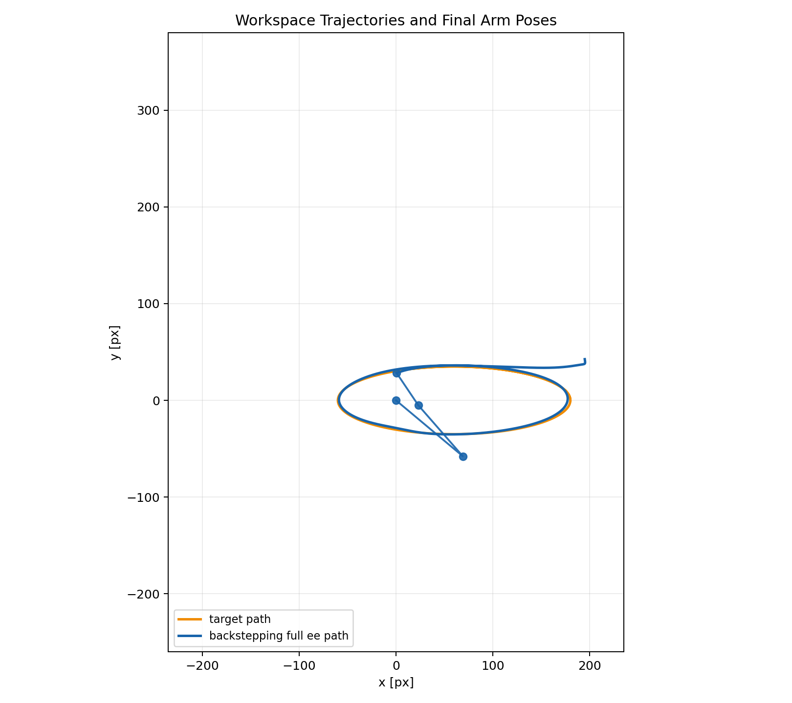

**Figure 1.** Workspace view for the nominal run. The orange ellipse is the reachable desired path. The green curve is the end-effector path of the `adaptive` controller (rendered first; see Limitations). The final arm poses of all four controllers are drawn as connected dots at the end of the trajectory. The `adaptive` controller's end-effector wanders far from the ellipse; the backstepping variants and `adaptive_simp` converge to poses near the ellipse.

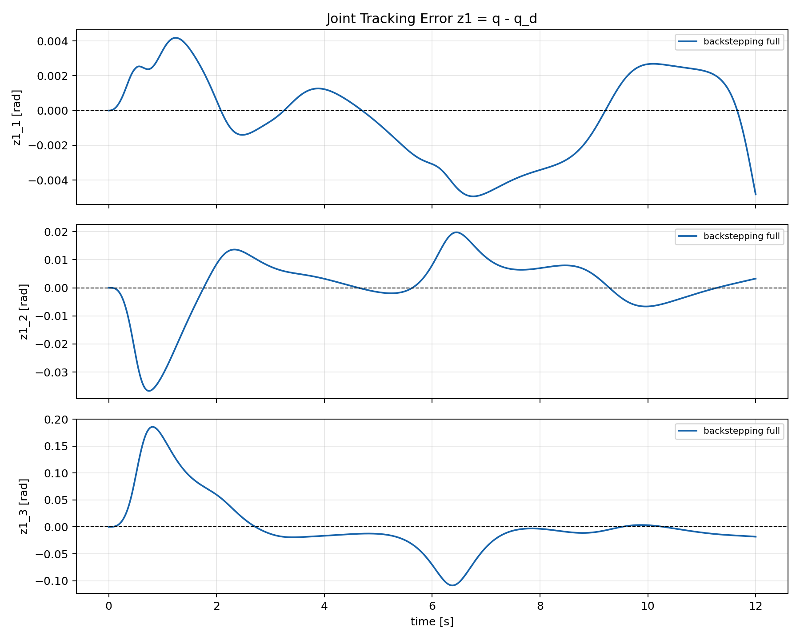

**Figure 2.** Per-joint position error $z_1$ over time. `backstepping_full` (dark blue) and `backstepping_simp` (purple) reach the $10^{-2}$ rad band after ~4 s and stay there. `adaptive_simp` (light green) settles to a small residual error per joint. `adaptive` (dark green) shows large persistent oscillations on all three joints — its model assumptions are violated by the true plant.

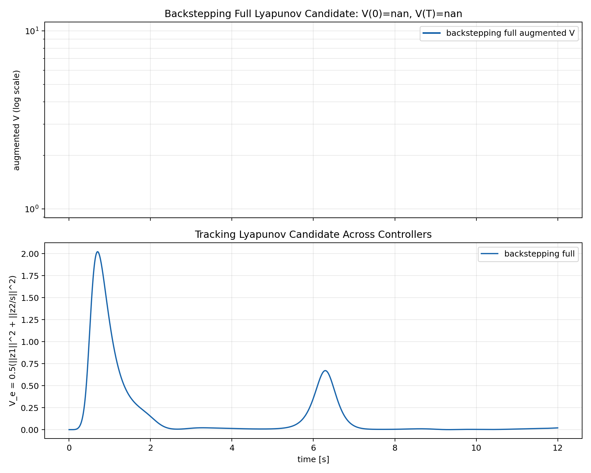

**Figure 3.** Top panel: augmented Lyapunov candidate $V_a$ for `adaptive`. $V_a$ starts at 0 (matching initial estimates) and grows to $\approx 10^3$ — the candidate cannot decrease because the underlying plant model is wrong, so the proof's assumptions do not apply. Bottom panel: tracking-energy $V_e$ for all four controllers. Both backstepping variants drive $V_e$ to nearly zero; `adaptive_simp` after a transient settles to $V_e \approx 5$; `adaptive` stays at $V_e \approx 300$–$400$ throughout.

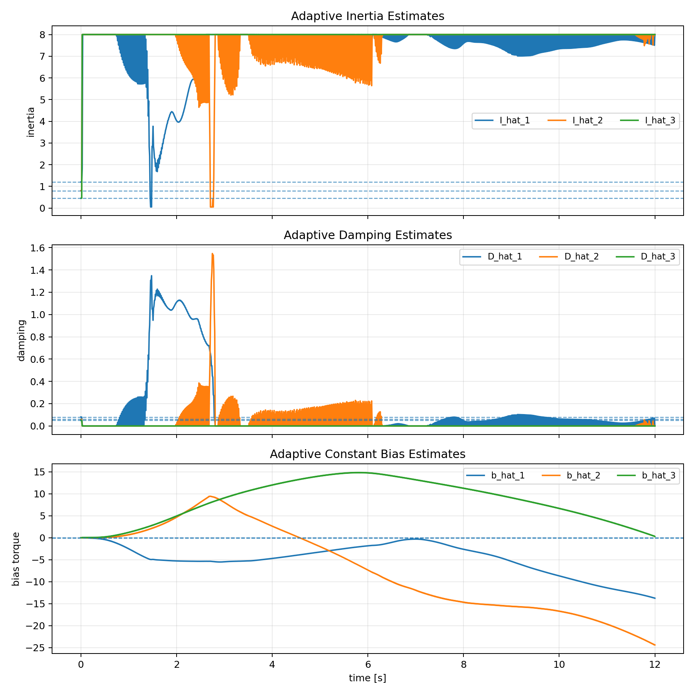

**Figure 4.** Parameter traces of the `adaptive` controller. Inertia estimates $\hat H$ saturate at the upper configured bound $[8, 8, 8]$, damping $\hat D$ stays near zero, and bias $\hat b$ drifts to large negative values. The estimates have no physical interpretation here because they are fitted to the wrong plant model.

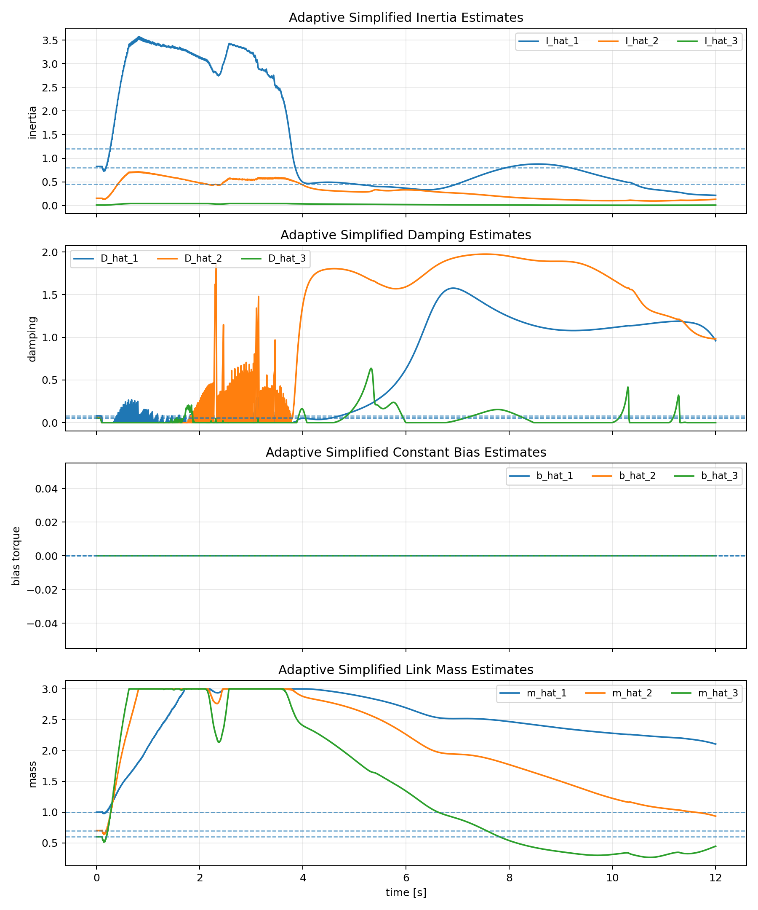

**Figure 5.** Parameter traces of `adaptive_simp`. Mass estimates initially saturate at the upper bound (3.0 kg) during the high-acceleration startup transient, then drift down towards the true values $[1.0, 0.7, 0.6]$ as the trajectory settles, without ever fully converging — persistent excitation is not provided by the elliptical reference.

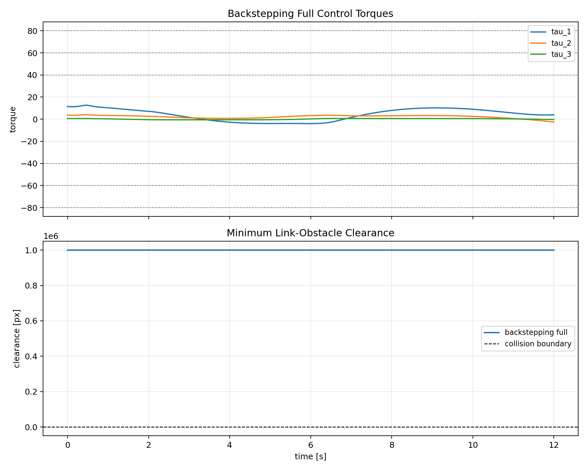

**Figure 6.** Control torques of the `adaptive` controller (top) and minimum link-obstacle clearance (bottom, sentinel value since no obstacles are present).

### Interpretation of the nominal scenario

- `backstepping_full` achieves the cleanest tracking with low RMS torque (7.3 Nm). The full feedforward exactly cancels $M, C, G$, leaving only the small-gain feedback to handle the initial transient.
- `backstepping_simp` is marginally better in tail mean error because it uses lower-amplitude torques for the same gains — at $\omega = 0.7$ rad/s the missing Coriolis term is small and the slight loss of accuracy is compensated by tighter feedback action.
- `adaptive_simp` performs respectably but has a long transient (the mass adaptation has to settle before the controller can track well). At the configured $\Gamma_m$ it converges to a useful operating regime within ~4 s.
- `adaptive` (Slotine-Li, Project 2 controller) is unable to track even in this nominal scenario, demonstrating the importance of matching the controller's model class to the plant.

## 9. Results: Payload Scenario

Plots in this section come from `figures/comparison/payload/`. The real third-link mass and inertia are tripled; the controllers continue to use the nominal values.

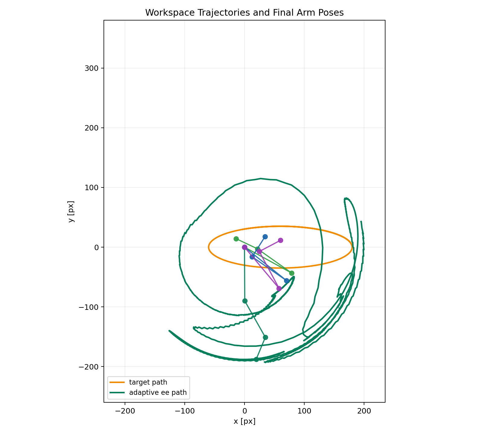

**Figure 7.** Workspace view for the payload run. The end-effector trace of the first rollout (here `adaptive`) wanders even further than in the nominal case. The final arm poses of the backstepping controllers drift away from the ellipse because their feedforward is now significantly wrong on the third link.

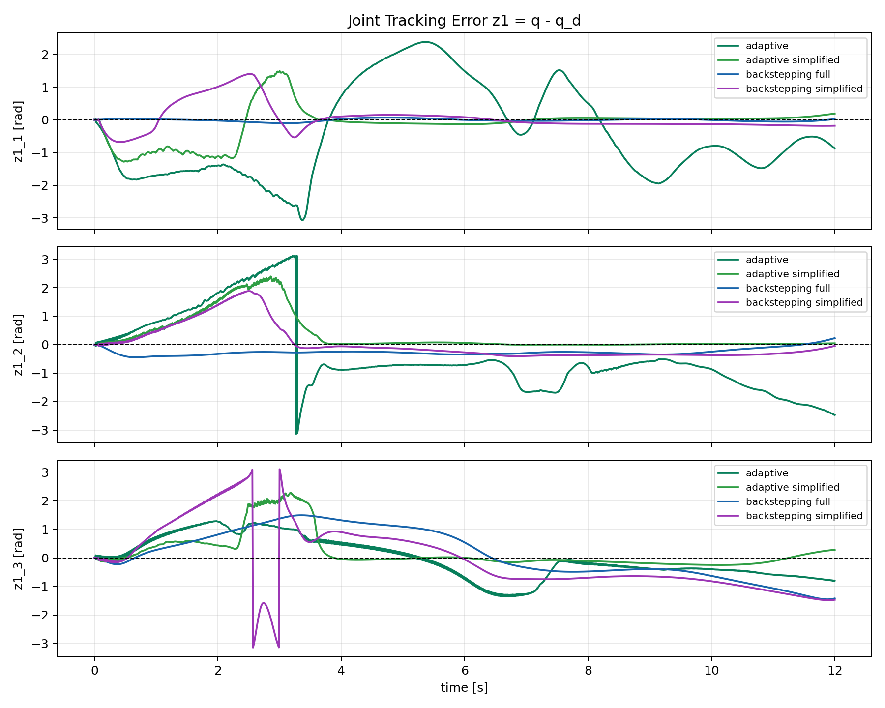

**Figure 8.** Per-joint position error $z_1$. `adaptive_simp` (light green) is the only controller whose error per joint settles below $\approx 0.2$ rad. Both backstepping variants stay at errors of order $1$ rad on the third joint, and `adaptive` is at the same large amplitude as in the nominal scenario.

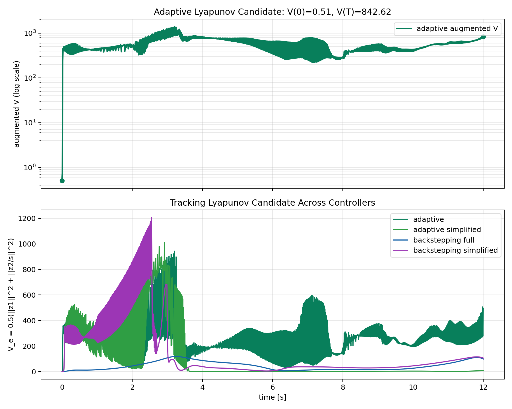

**Figure 9.** Top panel: augmented $V_a$ for `adaptive` (now starting at $V_a \approx 0.5$ because the initial mass estimate differs from the true tripled mass) stays in the $10^2$–$10^3$ band — adaptation cannot help because the model class is wrong. Bottom panel: tracking-energy $V_e$. Only `adaptive_simp` decays to a small value ($\approx 7$) over the run. Both backstepping variants stabilise at $V_e \approx 100$, an order of magnitude above their nominal value.

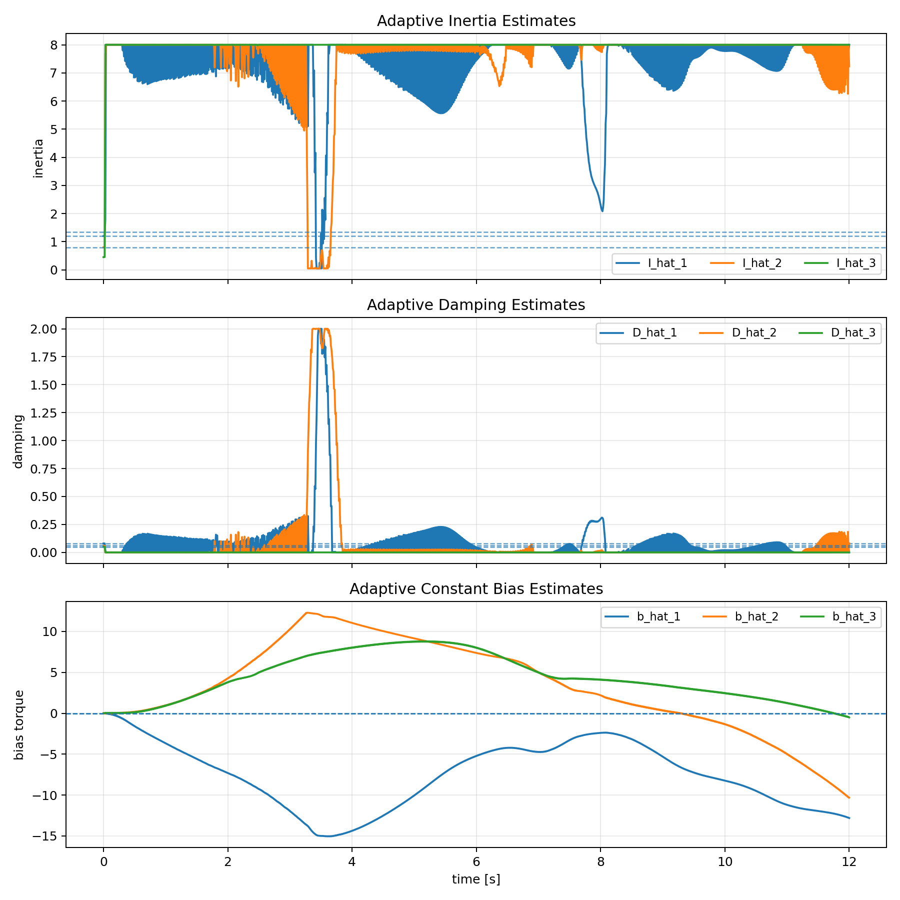

**Figure 10.** Slotine-Li parameter traces in payload. The shape of the traces is essentially unchanged from the nominal scenario because the controller does not see the payload as a parameter it can adapt — its model has scalar $(H, D, b)$, not link-mass parameters.

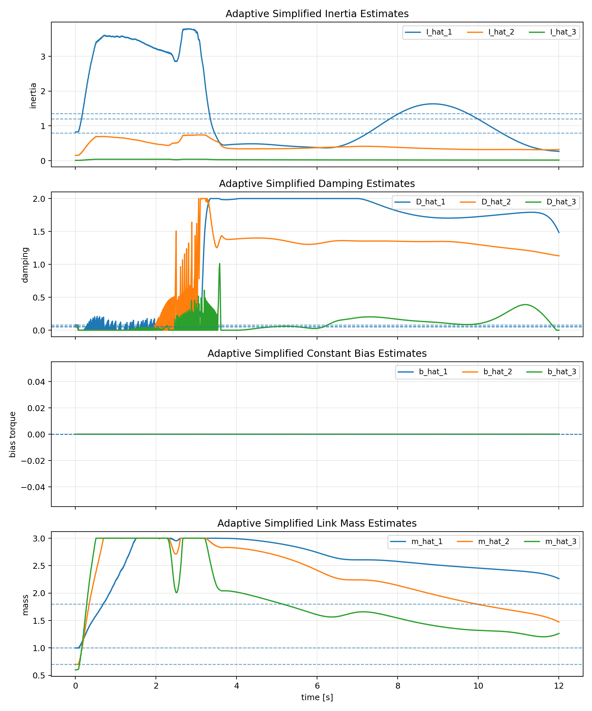

**Figure 11.** Adaptive backstepping parameter traces in payload. The third-link mass estimate (green) drops below the second-link estimate by the end of the run, reflecting the fact that the gravity regressor cannot disentangle the masses without persistent excitation. Nevertheless tracking succeeds, because the regressor-based control law cancels the gravity error in the direction that actually appears at the end-effector.

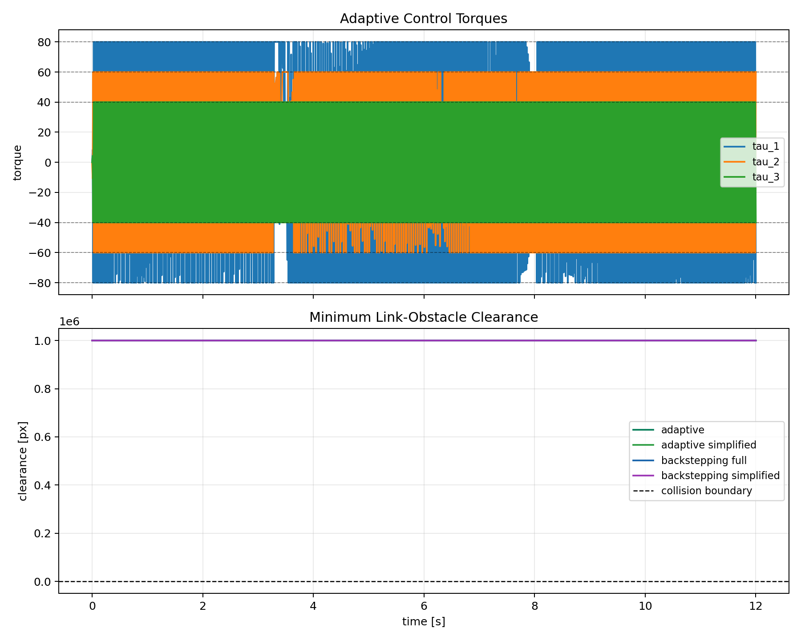

**Figure 12.** Control torques and clearance. The third joint's torque is visibly larger in payload than in nominal, consistent with the additional gravity load. No torque-limit saturation events are recorded for the backstepping controllers in this run.

### Interpretation of the payload scenario

- `backstepping_full` and `backstepping_simp` fail because the feedforward they apply uses the nominal $G(q)$ and $M(q)$, while the true plant has a third-link gravity contribution roughly three times larger. The controllers commit a constant feedforward error proportional to the mass mismatch, which the feedback gains $K_1, K_2 = 10$ cannot fully cancel given the actuator limits.
- `adaptive_simp` survives because its gravity regressor explicitly identifies the direction in which the model is wrong (the column of $Y_g(q)$ corresponding to $m_3$) and adapts the mass estimate to cancel that direction. The actual mass estimate does not converge to 1.8 kg — it cannot, due to the lack of persistent excitation — but it shifts enough to make the controlled gravity term close to the real one along the trajectory.
- `adaptive` fails for the same structural reason as in nominal, with no qualitative change.

## 10. Comparison Discussion

The mandatory Project 2+ comparison (§10 of the course requirements) is structured as four controllers × two scenarios. The failure modes observed are summarised below.

| Controller | Nominal scenario | Payload scenario |
|---|---|---|
| `backstepping_full` | works: tail $\|z_1\| \approx 0.011$ rad, 100 % success | **fails: steady-state tracking error** of order 1 rad on joint 3; wrong feedforward direction |
| `backstepping_simp` | works: tail $\|z_1\| \approx 0.008$ rad, 100 % success | **fails: similar to `backstepping_full`**, slightly worse because missing Coriolis term also matters more |
| `adaptive_simp` | works after transient: tail $\|z_1\| \approx 0.30$ rad, 42 % success | **works: tail $\|z_1\| \approx 0.20$ rad, 77 % success — the only controller that survives** |
| `adaptive` | **fails: persistent oscillations**, $V_e \approx 400$, parameter estimates drift to bounds | fails identically — wrong plant model in both cases |

The comparison demonstrates three distinct lessons that match the course's stated useful failure modes (§10 of the requirements):

1. **Slow convergence / poor tracking from wrong model class.** The Slotine-Li controller designed for a diagonal joint-space plant cannot track on a full-physics manipulator no matter the scenario. This is a *wrong-tool* failure: the adaptation laws are correct for their model class, but the model class does not contain the true plant.
2. **Steady-state error under uncertainty.** The two non-adaptive backstepping controllers, while excellent under nominal conditions, fail to reject a structural parameter mismatch (the payload). They commit a feedforward error that the feedback gains cannot fully cancel within actuator limits.
3. **Recovery via adaptation with the correct regressor structure.** The adaptive-backstepping controller `adaptive_simp` uses the gravity regressor $Y_g(q)$ to explicitly capture the direction in which the model can be wrong. Tracking is restored asymptotically even when neither $\hat m$ nor $\tilde m$ separately converges to a clean value — what matters is that $Y_g(q)\hat m \to G(q,m)$ along the trajectory.

A simpler comparison reading is also valid: backstepping is best when the model is exact; adaptive backstepping is best when it is not.

## 11. Limitations

The following limitations are honest about what the implementation does and does not provide, in line with §13 of the course requirements.

- **Simplified Lyapunov form.** Section 4.1 uses $V = \tfrac{1}{2}(\|z_1\|^2 + \|z_2\|^2)$ instead of the canonical $V = \tfrac{1}{2}\|z_1\|^2 + \tfrac{1}{2}z_2^\top M z_2$. The closed-loop conclusion is the same, but the simplified form does not exploit the skew-symmetry of $\dot M - 2C$ and therefore does not generalise as cleanly to settings where $M$ is configuration-dependent and changing rapidly.
- **No persistent excitation.** The elliptical reference is too regular to yield persistent excitation in the gravity regressor. The mass estimates of `adaptive_simp` therefore stay bounded but do not converge to the true masses. Tracking is asymptotic, identification is not.
- **`workspace_trajectories.png` shows only one EE path.** The current implementation of `_save_workspace` in `src/visualisation.py` draws the end-effector trace of the *first* rollout in the dictionary order and only the final arm poses of the others. Comparing EE paths across controllers therefore requires `joint_tracking_errors_z1.png` and the per-controller GIFs.
- **Torque saturation is not modelled in the proof.** The simulator clips torques to actuator bounds before integration, but Section 4.1 assumes unsaturated control. In the runs reported here no saturation events occur for the backstepping controllers; for the Slotine-Li controller saturation is frequent (see `saturation_fraction` in `summary.csv`), which contributes to its failure.
- **No sensor noise, no delay, no actuator dynamics.** All signals are exact. Adding noise or first-order actuator dynamics is a natural next step and is expected to mostly affect the adaptation gains, not the conclusions.
- **Gravity-only regressor.** The implementation linearises $G(q,m)$ in the link masses but does not similarly linearise $M(q)$ in $m$. A full mass-regressor parametrisation would also adapt the inertia matrix; this is left for future work.
- **The Slotine-Li controller is structurally mismatched.** It is included as a deliberate negative baseline; its results should not be interpreted as a fair benchmark of adaptive control in general.

## 12. AI Usage

Parts of the README structure and prose, as well as the cross-checks between code and equations, were drafted with the help of an AI assistant. All mathematical claims have been verified against the code; all numerical values in the result tables are taken directly from `data/comparison/*/summary.csv` produced by the included scripts.
