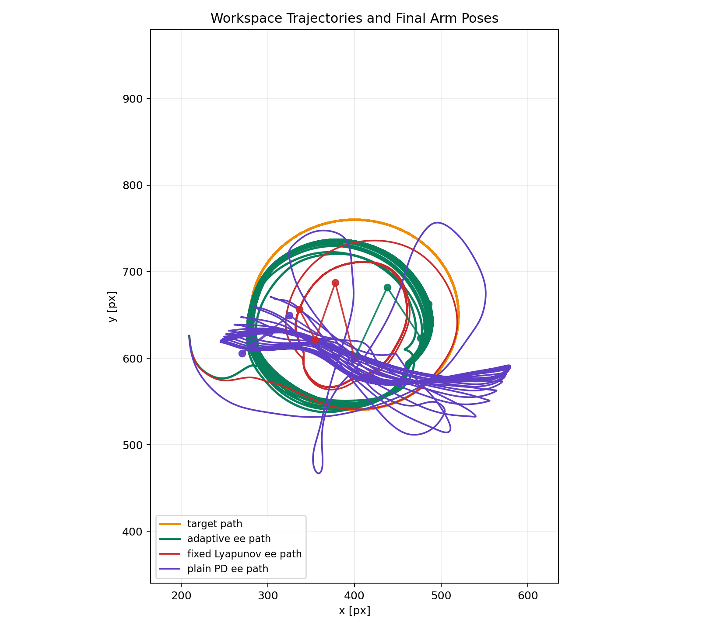
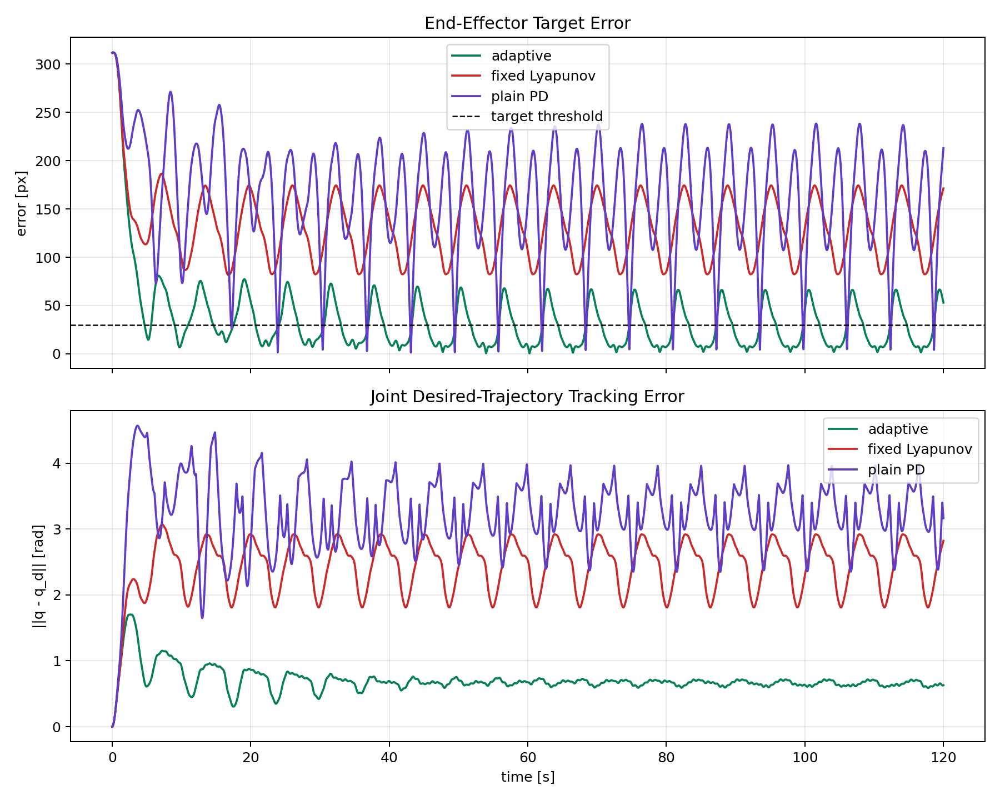
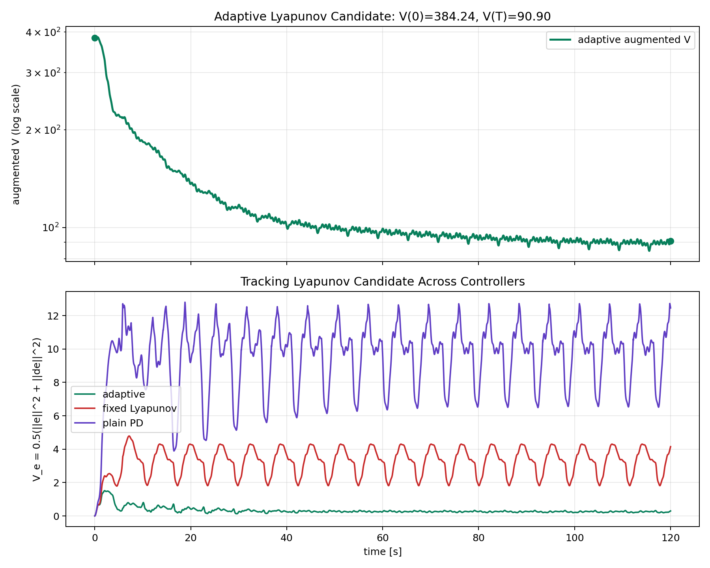
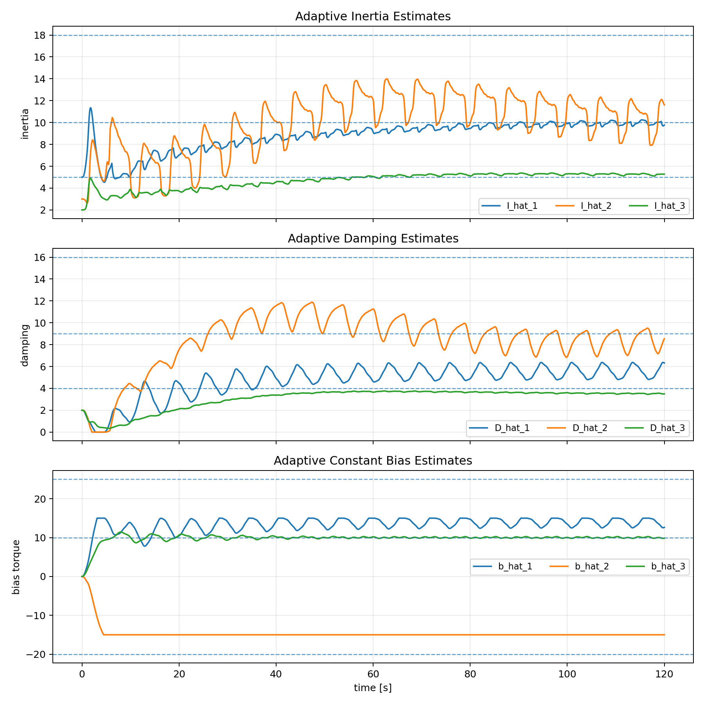
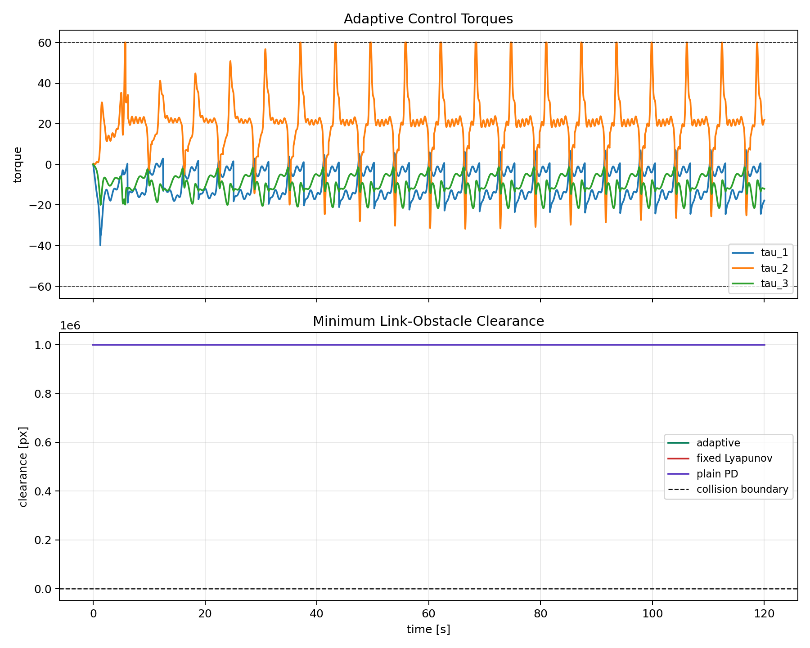
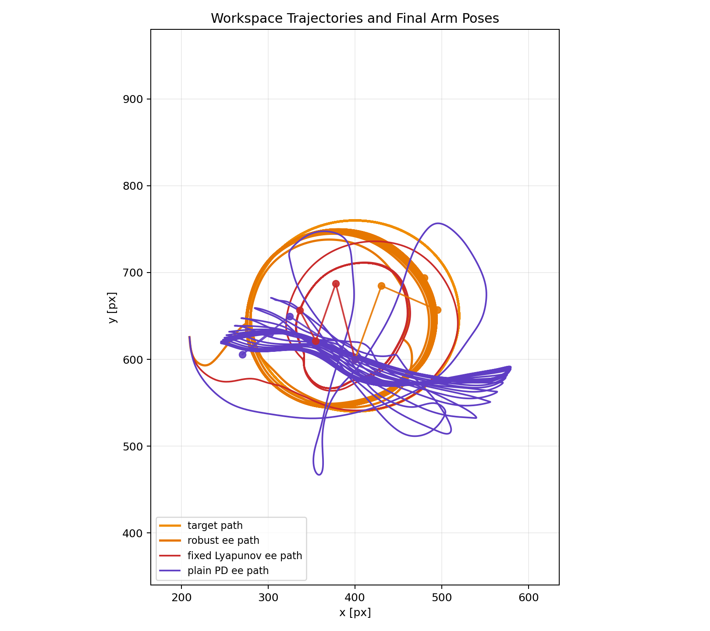
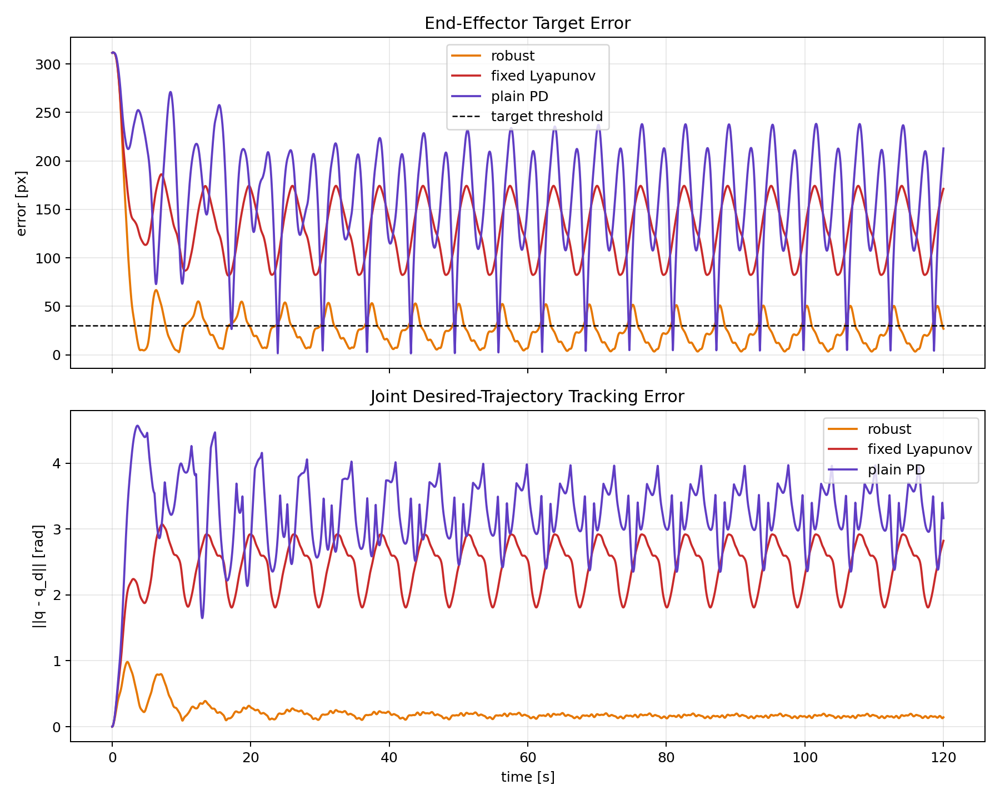
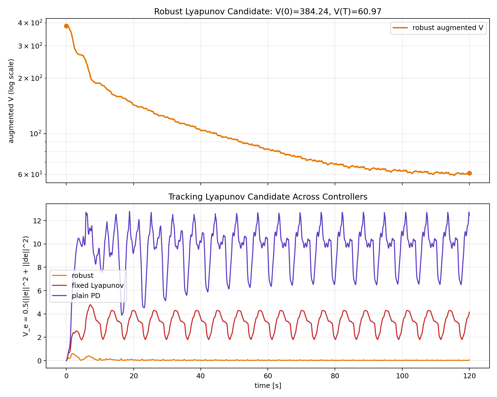
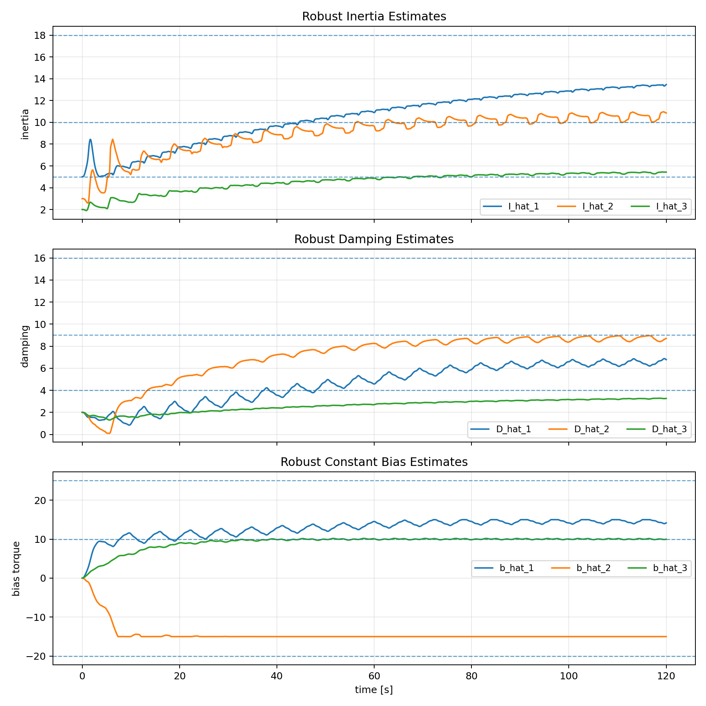
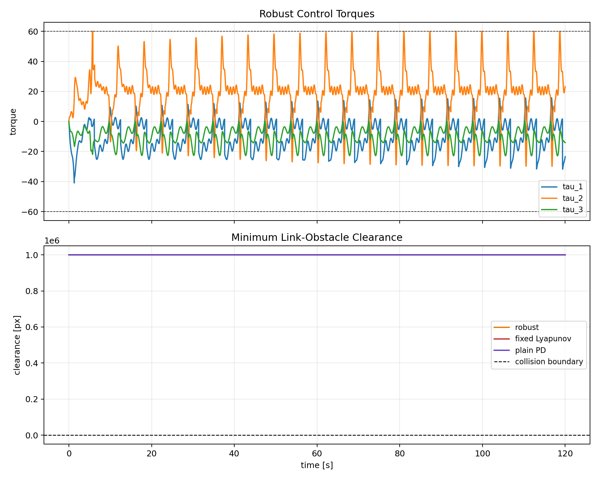

# Project 2: Adaptive and Robust Adaptive Control of a 3-DOF Planar Manipulator

This project studies adaptive control for a fixed-base 3-link
planar manipulator. The arm must track a moving target trajectory under
large model mismatch and external joint torques. The implementation includes:

- a pure adaptive Lyapunov controller,
- a robust adaptive controller with an added sliding-mode boundary-layer term,
- a fixed-model Lyapunov baseline,
- a plain joint-space PD baseline,
- generated plots, rollout data, and GIF animations for the pure and robust
  adaptive runs.

## Quick Visual Summary

The committed final comparison artifacts are grouped into two runs:

- `figures/figures_pure/` and `animations/adaptive_manipulator_pure.gif`
  show the pure adaptive controller against the baselines.
- `figures/figures_robust/` and `animations/adaptive_manipulator_robust.gif`
  show the robust adaptive controller against the same baselines.

The metrics JSON uses the key `adaptive` for the main experiment slot in both
folders. In `figures/figures_robust/`, that slot contains the robust adaptive
controller generated with `python main.py --robust`; the regenerated figures
and GIF label it as `robust`.


## Project Structure

```text
.
|-- README.md
|-- requirements.txt
|-- pyproject.toml
|-- main.py
|-- configs/
|   `-- default.json
|-- src/
|   |-- __init__.py
|   |-- config.py
|   |-- system.py
|   |-- controller.py
|   |-- simulation.py
|   |-- visualization.py
|   `-- main.py
|-- figures/
|   |-- figures_pure/
|   `-- figures_robust/
`-- animations/
    |-- adaptive_manipulator_pure.gif
    `-- adaptive_manipulator_robust.gif
```

Code responsibilities:

| File | Responsibility |
|---|---|
| `src/system.py` | manipulator kinematics, moving obstacles, clearance, torque dynamics |
| `src/controller.py` | reference generator, pure adaptive control, robust adaptive control, baselines |
| `src/simulation.py` | closed-loop rollouts, metrics, CSV export, Lyapunov values |
| `src/visualization.py` | figures and GIF animation |
| `src/config.py` | JSON config loading into typed dataclasses |
| `src/main.py` | command-line orchestration |
| `main.py` | root launcher that calls `src.main.main()` |

## Problem Definition

The control problem is to move the end effector of a 3-DOF planar arm along a
moving target trajectory while compensating for uncertain joint dynamics. The
project is an adaptive-control project, not a reinforcement-learning project.

The state is

```math
x =
\begin{bmatrix}
q^T & \dot q^T
\end{bmatrix}^T
\in \mathbb{R}^6,
\qquad
q =
\begin{bmatrix}
q_1 & q_2 & q_3
\end{bmatrix}^T,
\qquad
\dot q =
\begin{bmatrix}
\dot q_1 & \dot q_2 & \dot q_3
\end{bmatrix}^T.
```

Here `q_i` is the angle of joint `i` in radians and `dot q_i` is its angular
velocity. The control input is the joint torque vector

```math
\tau =
\begin{bmatrix}
\tau_1 & \tau_2 & \tau_3
\end{bmatrix}^T.
```

The default torque constraint in `configs/default.json` is

```text
|tau_i| <= 60, i = 1,2,3.
```

The implementation uses a simplified diagonal joint-space plant rather than a
full rigid-body manipulator model. This simplification is intentional: it keeps
the plant linear in unknown constant parameters, which is the structure needed
for the Lyapunov adaptive-control proof.

## System Description

The arm has three revolute joints and link lengths

```text
L = [90, 70, 40] px.
```

The fixed base is

```text
p_base = [400, 600] px.
```

For link endpoint `i`, define the cumulative joint angle

```math
\alpha_k(q) = \sum_{\ell=1}^{k} q_\ell.
```

The forward kinematics are

```math
p_i(q)
=
p_{base}
+
\sum_{k=1}^{i}
L_k
\begin{bmatrix}
\cos \alpha_k(q) \\
\sin \alpha_k(q)
\end{bmatrix},
\qquad i=1,2,3.
```

The end-effector position is `p_3(q)`. The point Jacobian for endpoint `i` is
denoted by

```math
J_i(q) = \frac{\partial p_i(q)}{\partial q}.
```

The moving target is an ellipse:

```math
p_T(t)
=
c_T
+
\begin{bmatrix}
a_x \cos(\omega_T t) \\
a_y \sin(\omega_T t)
\end{bmatrix}.
```

Its velocity is

```math
\dot p_T(t)
=
\begin{bmatrix}
-a_x \omega_T \sin(\omega_T t) \\
a_y \omega_T \cos(\omega_T t)
\end{bmatrix}.
```

The code also supports moving circular obstacles. Obstacle `j` has radius
`r_obs` and center

```math
c_j(t)
=
c_{j,0}
+
\begin{bmatrix}
A_{jx}\cos(\omega_j t + \phi_j) \\
A_{jy}\sin(\omega_j t + \phi_j)
\end{bmatrix}.
```

The final committed pure and robust comparison artifacts were generated with
`--no-obstacles` to isolate disturbance rejection. That is why the stored
summary metrics show `min_clearance_px = 1000000.0`, the sentinel value used
when obstacle clearance is disabled. The obstacle-aware planner and clearance
measurement remain implemented, and obstacle-enabled runs are produced by
omitting `--no-obstacles`.

## Plant Dynamics and Uncertainty

The simulated plant is

```math
H \ddot q + D \dot q = \tau + b + w(t).
```

Definitions:

- `H = diag(H_1,H_2,H_3)` is the true positive diagonal inertia matrix.
- `D = diag(D_1,D_2,D_3)` is the true positive diagonal viscous damping matrix.
- `b in R^3` is an unknown constant joint-torque bias.
- `w(t) in R^3` is an optional bounded time-varying joint disturbance.
- `tau` is clipped to the configured actuator limits before integration.

The default values are

```text
H = [18, 10, 5]
D = [16, 9, 4]
b = [25, -20, 10]
w(t) = [9 sin(5t), 8 sin(9t), 4 sin(3t)]
```

The plant is integrated using fourth-order Runge-Kutta with default step
`dt = 0.02 s`.

The unknown constant parameter vector for joint `i` is

```math
\theta_i =
\begin{bmatrix}
H_i & D_i & b_i
\end{bmatrix}^T.
```

The time-varying part `w(t)` is not part of this parameter vector. The pure
adaptive asymptotic proof therefore applies exactly to the case `w(t)=0`; with
nonzero `w(t)`, pure adaptive control is a stress test. The robust adaptive
controller adds a sliding term to improve bounded-disturbance rejection.

## Reference Generator

The controller does not directly plan in task space. Instead, a kinematic
reference generator creates a desired joint trajectory

```math
q_d(t), \qquad \dot q_d(t), \qquad \ddot q_d(t).
```

The target-tracking task-space velocity is

```math
v_g
=
k_g (p_T - p_3(q_d)) + \dot p_T.
```

The generator maps this task velocity to joint velocity with damped least
squares:

```math
\dot q_g
=
J_3(q_d)^T
\left(
J_3(q_d)J_3(q_d)^T + \eta^2 I_2
\right)^{-1}
v_g.
```

When obstacles are enabled, every link endpoint receives a repulsive velocity
when it is inside the configured influence distance. For endpoint `i` and
obstacle center `c_j`, let

```math
\delta_{ij} = p_i(q_d) - c_j,
\qquad
d_{ij} = \|\delta_{ij}\|,
\qquad
\chi_{ij} = d_{ij} - r_{obs} - m_{safe}.
```

For `chi_ij` below the influence distance, the code adds a repulsive point
velocity in the direction `delta_ij / d_ij`, then maps it into joint space using
`J_i(q_d)^T`. The final desired joint velocity is clipped to
`max_joint_speed` and integrated to update `q_d`.

This planner is heuristic. The formal control proof below is a reference
tracking proof: if the generated reference is bounded and differentiable, the
adaptive controller tracks it. The proof is not a formal global obstacle-safety
certificate.

## Filtered Tracking Variables

For all model-based controllers, define the tracking error

```math
e = q - q_d,
\qquad
\dot e = \dot q - \dot q_d.
```

The filtered error, also called the sliding variable, is

```math
s = \dot e + \lambda e,
\qquad \lambda > 0.
```

The filtered reference velocity and acceleration are

```math
\dot q_r = \dot q_d - \lambda e,
\qquad
\ddot q_r = \ddot q_d - \lambda \dot e.
```

Since

```math
\dot s = \ddot q - \ddot q_r,
```

controlling `s` controls both the position and velocity tracking errors through
the stable first-order relation

```math
\dot e + \lambda e = s.
```

## Pure Adaptive Controller

The pure adaptive controller estimates inertia, damping, and constant bias:

```math
\hat H = diag(\hat H_1,\hat H_2,\hat H_3),
\qquad
\hat D = diag(\hat D_1,\hat D_2,\hat D_3),
\qquad
\hat b =
\begin{bmatrix}
\hat b_1 & \hat b_2 & \hat b_3
\end{bmatrix}^T.
```

Its torque law is

```math
\tau
=
\hat H \ddot q_r
+
\hat D \dot q
-
\hat b
-
K_s s,
```

where `K_s = diag(k_{s,1},k_{s,2},k_{s,3})` is positive definite.

For joint `i`, the regressor form is

```math
Y_i(q,\dot q,\ddot q_r)
=
\begin{bmatrix}
\ddot q_{r,i} & \dot q_i & -1
\end{bmatrix},
\qquad
Y_i\hat\theta_i
=
\hat H_i \ddot q_{r,i}
+
\hat D_i \dot q_i
-
\hat b_i.
```

The update laws are

```math
\dot{\hat H}_i = -\gamma_{H_i} s_i \ddot q_{r,i},
\qquad
\dot{\hat D}_i = -\gamma_{D_i} s_i \dot q_i,
\qquad
\dot{\hat b}_i = \gamma_{b_i} s_i,
```

with positive adaptation gains `gamma_H_i`, `gamma_D_i`, and `gamma_b_i`.
The implementation projects the estimates into configured bounds to keep them
finite in discrete time.

## Robust Adaptive Controller

The robust adaptive controller uses the same filtered errors and the same
parameter adaptation laws, but adds a boundary-layer sliding term:

```math
\tau
=
\hat H \ddot q_r
+
\hat D \dot q
-
\hat b
-
K_R s
-
\rho\,sat(s/\varepsilon).
```

Here

```math
sat(z_i)
=
\begin{cases}
1, & z_i > 1, \\
z_i, & |z_i| \le 1, \\
-1, & z_i < -1.
\end{cases}
```

The current implementation sets

```text
K_R = 2 K_s
rho = 5.0
epsilon = 0.5
```

inside `RobustAdaptiveController`. These robust gains are currently hard-coded
in `src/controller.py`, while the base adaptive gains are read from
`configs/default.json`.

The purpose of the extra term is to dissipate energy caused by the bounded
unmodeled disturbance `w(t)`. It trades a small boundary layer around `s = 0`
for improved disturbance rejection.

## Baseline Controllers

The fixed Lyapunov baseline uses the same filtered-error structure but does not
adapt:

```math
\tau
=
H_0 \ddot q_r
+
D_0 \dot q
-
K_s s.
```

It uses incorrect nominal values `H_0` and `D_0`, and it has no estimate of the
constant bias `b`.

The plain PD baseline is

```math
\tau = -K_p e - K_d \dot e.
```

It has no model compensation and no adaptation. These baselines satisfy the
Project 2 comparison requirement: they show steady-state error and poor
tracking under uncertainty compared with adaptive and robust adaptive control.

## Lyapunov Proof for Pure Adaptive Control

This proof is for the nominal adaptive model with unknown constant
`H`, `D`, and `b`, and with `w(t)=0`. It also assumes no actuator saturation,
exact state measurement, bounded differentiable reference signals, and positive
diagonal inertia.

Define parameter errors

```math
\tilde H = \hat H - H,
\qquad
\tilde D = \hat D - D,
\qquad
\tilde b = \hat b - b.
```

Using `dot s = ddot q - ddot q_r` and the plant equation

```math
H\ddot q + D\dot q = \tau + b,
```

we get

```math
H\dot s
=
\tau + b - D\dot q - H\ddot q_r.
```

Substitute the adaptive torque law:

```math
H\dot s
=
-K_s s
+
\tilde H \ddot q_r
+
\tilde D \dot q
-
\tilde b.
```

Use the augmented Lyapunov candidate

```math
V
=
\frac{1}{2}s^T Hs
+
\sum_{i=1}^{3}
\frac{\tilde H_i^2}{2\gamma_{H_i}}
+
\sum_{i=1}^{3}
\frac{\tilde D_i^2}{2\gamma_{D_i}}
+
\sum_{i=1}^{3}
\frac{\tilde b_i^2}{2\gamma_{b_i}}.
```

Because `H`, `D`, and `b` are constant,
`dot tilde H = dot hat H`, `dot tilde D = dot hat D`, and
`dot tilde b = dot hat b`. Therefore

```math
\dot V
=
s^T H\dot s
+
\sum_i \frac{\tilde H_i \dot{\hat H}_i}{\gamma_{H_i}}
+
\sum_i \frac{\tilde D_i \dot{\hat D}_i}{\gamma_{D_i}}
+
\sum_i \frac{\tilde b_i \dot{\hat b}_i}{\gamma_{b_i}}.
```

Substituting the closed-loop error dynamics gives

```math
\dot V
=
-s^T K_s s
+
\sum_i s_i\tilde H_i\ddot q_{r,i}
+
\sum_i s_i\tilde D_i\dot q_i
-
\sum_i s_i\tilde b_i
+
\sum_i \frac{\tilde H_i \dot{\hat H}_i}{\gamma_{H_i}}
+
\sum_i \frac{\tilde D_i \dot{\hat D}_i}{\gamma_{D_i}}
+
\sum_i \frac{\tilde b_i \dot{\hat b}_i}{\gamma_{b_i}}.
```

Now substitute the adaptive laws:

```math
\frac{\tilde H_i \dot{\hat H}_i}{\gamma_{H_i}}
=
-\tilde H_i s_i\ddot q_{r,i},
\qquad
\frac{\tilde D_i \dot{\hat D}_i}{\gamma_{D_i}}
=
-\tilde D_i s_i\dot q_i,
\qquad
\frac{\tilde b_i \dot{\hat b}_i}{\gamma_{b_i}}
=
\tilde b_i s_i.
```

All parameter-error cross terms cancel:

```math
\dot V = -s^T K_s s \le 0.
```

Thus `V(t)` is nonincreasing, `s` is bounded, and all projected parameter
estimates stay bounded. Since

```math
\int_0^\infty s(t)^T K_s s(t)\,dt
\le
V(0) - V(\infty)
<
\infty,
```

the filtered error is square integrable. Under the standard bounded-reference
and bounded-regressor assumptions, `dot s` is bounded. Barbalat's lemma then
gives

```math
s(t) \to 0.
```

Finally, `dot e + lambda e = s` is an exponentially stable linear filter driven
by an input that converges to zero. Therefore

```math
e(t) \to 0,
\qquad
\dot e(t) \to 0.
```

The proof guarantees tracking, not exact parameter identification. Exact
parameter convergence additionally requires persistent excitation, which is not
guaranteed by the target trajectory.

## Robust Adaptive Stability Argument

Now include a bounded time-varying disturbance:

```math
H\ddot q + D\dot q = \tau + b + w(t),
\qquad
\|w(t)\| \le \bar w.
```

With the robust adaptive torque law and the same adaptive updates, the same
Lyapunov candidate gives

```math
\dot V
=
-s^T K_R s
-
\rho\,s^T sat(s/\varepsilon)
+
s^T w(t).
```

Since `s^T sat(s/epsilon) >= 0`,

```math
\dot V
\le
-\lambda_{min}(K_R)\|s\|^2
+
\|s\|\,\bar w.
```

Therefore `dot V < 0` whenever

```math
\|s\| > \frac{\bar w}{\lambda_{min}(K_R)}.
```

This proves ultimate boundedness of the filtered error for bounded
disturbances. If the robust gain is selected componentwise so that
`rho_i >= sup_t |w_i(t)|` outside the boundary layer, then the robust term can
cancel the worst-case disturbance component and recover a stronger decrease
condition outside `|s_i| <= epsilon`.

The implemented robust controller uses a finite boundary layer, so the expected
result is practical tracking rather than exact asymptotic convergence under
sinusoidal disturbance. This matches the experiments: robust adaptive control
reduces the final filtered error and tracking Lyapunov value compared with
pure adaptive control.

## Why the Fixed Baseline Fails

Consider the fixed controller with wrong model parameters and no bias estimate:

```math
\tau
=
H_0\ddot q_r + D_0\dot q - K_s s.
```

The closed-loop filtered dynamics contain uncompensated terms:

```math
H\dot s
=
-K_s s
+
(H_0-H)\ddot q_r
+
(D_0-D)\dot q
+
b
+
w(t).
```

Even if `K_s` is positive, the constant bias and model mismatch act as a
persistent forcing term. The result is steady-state tracking error or large
oscillation unless the feedback gain is made large enough to hide the mismatch.
This is exactly what the plots show: the fixed Lyapunov and PD baselines remain
well above the adaptive methods under the same disturbance.

## Algorithm Listing

For each controller and each simulation step:

1. Compute the target position `p_T(t)` and target velocity `dot p_T(t)`.
2. Compute obstacle centers `c_j(t)` unless obstacles are disabled.
3. Update the desired reference `q_d`, `dot q_d`, `ddot q_d` using the
   kinematic planner.
4. Read the plant state `q`, `dot q`.
5. Compute `e = q - q_d` and `dot e = dot q - dot q_d`.
6. Compute `s = dot e + lambda e`.
7. Compute `dot q_r = dot q_d - lambda e` and
   `ddot q_r = ddot q_d - lambda dot e`.
8. Compute controller torque:
   - pure adaptive: `hat H ddot q_r + hat D dot q - hat b - K_s s`,
   - robust adaptive: pure adaptive torque minus
     `rho sat(s/epsilon)` and with larger `K_R`,
   - fixed baseline: `H_0 ddot q_r + D_0 dot q - K_s s`,
   - PD baseline: `-K_p e - K_d dot e`.
9. Clip torque to actuator bounds.
10. For adaptive controllers, update `hat H`, `hat D`, and `hat b`.
11. Integrate the true plant with RK4.
12. Record state, target error, joint error, sliding norm, torques,
    disturbance, clearance, saturation, parameter estimates, and Lyapunov
    quantities.
13. After rollout, export JSON metrics, CSV time series, plots, and animation.

## Experimental Setup

Default configuration values:

| Quantity | Value |
|---|---:|
| simulation duration | `120 s` |
| integration step | `0.02 s` |
| tail metric window | `10 s` |
| initial joint angles | `[pi, -0.5, 0.7] rad` |
| target center | `[400, 650] px` |
| target amplitude | `[120, 110] px` |
| target angular rate | `1 rad/s` |
| target success threshold | `30 px` |
| true inertia | `[18, 10, 5]` |
| true damping | `[16, 9, 4]` |
| constant bias | `[25, -20, 10]` |
| sinusoidal disturbance amplitude | `[9, 8, 4]` |
| sinusoidal disturbance frequency | `[5, 9, 3]` |
| torque limits | `[60, 60, 60]` |
| adaptive `lambda` | `2.0` |
| pure adaptive sliding gain | `[6, 4, 3]` |
| robust sliding gain | `[12, 8, 6]` |
| robust `rho` | `5.0` |
| robust `epsilon` | `0.5` |
| initial inertia estimate | `[5, 3, 2]` |
| initial damping estimate | `[2, 2, 2]` |
| initial bias estimate | `[0, 0, 0]` |
| fixed baseline nominal inertia | `[5, 3, 2]` |
| fixed baseline nominal damping | `[2, 2, 2]` |
| PD gains `K_p` | `[5, 4, 3]` |
| PD gains `K_d` | `[2, 1.5, 1]` |

Obstacle-enabled defaults:

| Obstacle quantity | Value |
|---|---:|
| radius | `30 px` |
| base centers | `[[440,480], [520,750]] px` |
| amplitudes | `[[8,8], [8,10]] px` |
| angular rates | `[0.20, 0.25] rad/s` |
| phases | `[0, 1] rad` |

## Reproducibility

Install dependencies:

```bash
pip install -r requirements.txt
```

Run a quick smoke test:

```bash
python main.py --duration 5 --no-plots --no-animation
```

Run the pure adaptive comparison with moving obstacles enabled:

```bash
python main.py
```

Run the robust adaptive comparison with moving obstacles enabled:

```bash
python main.py --robust
```

Run without GIF generation:

```bash
python main.py --no-animation
python main.py --robust --no-animation
```

Reproduce the committed pure and robust artifact folders, which isolate
disturbance rejection by disabling obstacles:

```bash
python main.py --no-obstacles
mkdir -p figures/figures_pure
cp figures/*.png figures/summary_metrics.json figures/rollout_timeseries.csv figures/figures_pure/
cp animations/adaptive_manipulator.gif animations/adaptive_manipulator_pure.gif

python main.py --robust --no-obstacles
mkdir -p figures/figures_robust
cp figures/*.png figures/summary_metrics.json figures/rollout_timeseries.csv figures/figures_robust/
cp animations/adaptive_manipulator.gif animations/adaptive_manipulator_robust.gif
```

Produced outputs:

| Output | Description |
|---|---|
| `summary_metrics.json` | final, mean, tail, Lyapunov, torque, saturation, and parameter metrics |
| `rollout_timeseries.csv` | synchronized samples for all controllers |
| `workspace_trajectories.png` | target path, end-effector paths, and final arm poses |
| `tracking_errors.png` | target error and desired-joint-trajectory tracking error |
| `lyapunov_values.png` | augmented adaptive Lyapunov and comparable tracking energy |
| `adaptive_parameter_estimates.png` | online estimates of inertia, damping, and bias |
| `control_and_clearance.png` | torques and minimum clearance |
| `adaptive_manipulator*.gif` | animation of arm motion, target, trajectories, and tracking Lyapunov values |

## Result Summary

The archived comparison uses the same uncertain plant and disturbance for all
controllers. The robust adaptive controller improves the main adaptive-control
experiment, while the fixed Lyapunov and PD baselines remain weak under the
same uncertainty.

Adaptive-controller slot comparison:

| Metric | Pure adaptive | Robust adaptive |
|---|---:|---:|
| final target error | `52.928 px` | `26.821 px` |
| tail mean target error | `26.484 px` | `23.625 px` |
| tail success fraction | `0.622` | `0.712` |
| final joint error norm | `0.630 rad` | `0.142 rad` |
| tail mean joint error norm | `0.646 rad` | `0.155 rad` |
| final sliding norm | `1.422` | `0.498` |
| tail mean sliding norm | `1.309` | `0.343` |
| final tracking Lyapunov `V_e` | `0.300` | `0.047` |
| RMS torque | `29.236` | `30.268` |
| saturation fraction | `0.016` | `0.004` |
| collision count in archived no-obstacle run | `0` | `0` |

Baseline comparison from the same archived summaries:

| Controller | Tail mean target error | Tail success fraction | Final `V_e` |
|---|---:|---:|---:|
| pure adaptive | `26.484 px` | `0.622` | `0.300` |
| robust adaptive | `23.625 px` | `0.712` | `0.047` |
| fixed Lyapunov | `124.136 px` | `0.000` | `4.150` |
| plain PD | `152.020 px` | `0.044` | `12.456` |

Main conclusions:

- Both adaptive methods substantially outperform the non-adaptive baselines.
- The robust adaptive term reduces the final sliding norm and tracking
  Lyapunov value under the sinusoidal disturbance.
- The fixed Lyapunov baseline cannot remove steady error caused by wrong model
  parameters and missing bias compensation.
- The PD baseline lacks model compensation and performs worst in the final
  tracking energy.
- The pure adaptive formal asymptotic proof does not cover the sinusoidal
  disturbance; the robust result should be interpreted as practical bounded
  disturbance rejection.

## Pure Adaptive Figures



Figure 1. Pure adaptive run workspace trajectories. The orange curve is the
moving target. The green end-effector path is the pure adaptive controller,
while red and purple are the fixed Lyapunov and PD baselines. The pure adaptive
controller follows the target path much more closely than the baselines.



Figure 2. Pure adaptive target error and joint trajectory tracking error. The
fixed and PD baselines show large persistent error under the same model
mismatch and disturbance.



Figure 3. Pure adaptive Lyapunov values. The augmented adaptive Lyapunov
quantity records the proof-oriented energy for the adaptive controller, while
the tracking energy `V_e` gives a comparable error measure across controllers.



Figure 4. Pure adaptive parameter estimates. The estimates are projected into
configured bounds. Exact physical-parameter convergence is not required for
tracking and is not guaranteed without persistent excitation.



Figure 5. Pure adaptive torques and clearance signal. The archived comparison
was generated with obstacles disabled, so clearance is the no-obstacle sentinel.
Torque saturation is limited but nonzero, which is one reason the discrete
simulation does not exactly reproduce the continuous-time Lyapunov equality.

## Robust Adaptive Figures



Figure 6. Robust adaptive run workspace trajectories. The robust controller
follows the target path more tightly than the pure adaptive run and much more
tightly than the baselines.



Figure 7. Robust adaptive tracking errors. The robust boundary-layer term
reduces the final joint tracking error and sliding norm relative to the pure
adaptive run.



Figure 8. Robust adaptive Lyapunov-style values. The augmented candidate drops
from `384.24` to `60.97`; the comparable tracking energy `V_e` ends at `0.047`
for robust adaptive control versus `4.150` for the fixed baseline and `12.456`
for PD.



Figure 9. Robust adaptive parameter estimates. The robust controller uses the
same adaptive laws as the pure adaptive controller, but the sliding-mode term
changes the closed-loop trajectory and therefore changes the estimates.



Figure 10. Robust adaptive torques and clearance signal. The robust controller
uses slightly higher RMS torque than pure adaptive control, but it obtains
better final tracking and lower saturation fraction in the archived run.

## Animation Interpretation

The GIFs show the arm configuration, end-effector traces, moving target, and a
side panel with normalized tracking Lyapunov values. The pure animation shows
that adaptation alone can substantially outperform fixed and PD baselines. The
robust animation shows the added boundary-layer term reducing oscillatory
tracking error under the same disturbed plant.

The animations are not decorative: they expose the actual closed-loop behavior,
the current simulation time, the target path, the response of each controller,
and how the tracking energy evolves.

## Notation and Code Mapping

| Symbol in README | Meaning | Code signal |
|---|---|---|
| `q_d`, `dot q_d`, `ddot q_d` | generated desired joint trajectory | `ReferenceState.q`, `ReferenceState.dq`, `ReferenceState.ddq` |
| `e`, `dot e` | joint tracking error and velocity error | `ControlInfo.q_error`, `ControlInfo.dq_error` |
| `s` | filtered/sliding tracking error | `ControlInfo.sliding_error` |
| `dot q_r`, `ddot q_r` | filtered reference signals | `ControlInfo.dq_r`, `ControlInfo.ddq_r` |
| `hat H`, `hat D`, `hat b` | adaptive estimates | `ControlInfo.inertia_hat`, `damping_hat`, `bias_hat` |
| `V` | augmented adaptive Lyapunov candidate | `Rollout.augmented_lyapunov` |
| `V_e` | comparable tracking energy | `Rollout.tracking_lyapunov` |
| `tau` | clipped torque applied to plant | `Rollout.tau` |
| `tau_raw` | commanded torque before clipping | `Rollout.tau_raw` |

## Limitations

- The plant is a diagonal joint-space model, not a full manipulator
  `M(q), C(q,dot q), G(q)` rigid-body model.
- The obstacle-aware reference generator is heuristic artificial potential
  fields plus damped least squares, not a control-barrier-function proof.
- The pure adaptive convergence proof assumes `w(t)=0`; the current disturbance
  stress test includes sinusoidal torque components.
- The robust proof gives practical boundedness under bounded disturbances, not
  exact asymptotic convergence inside the boundary layer.
- The continuous-time proofs assume no torque saturation, while the simulation
  clips torque and records saturation.
- Parameter convergence is not guaranteed without persistent excitation.
- No sensor noise, delays, or actuator dynamics are simulated.

## Submission Checklist Alignment

The repository contains the required `README.md`, `src/`, `figures/`,
`animations/`, and `configs/` folders. The README defines the problem, plant,
state, input, constraints, unknown parameters, dynamics, method, proofs,
algorithm, setup, commands, outputs, plots, animations, comparisons, and
limitations. The fixed Lyapunov and PD baselines provide the mandatory
Project 2 comparison against weaker alternatives.
