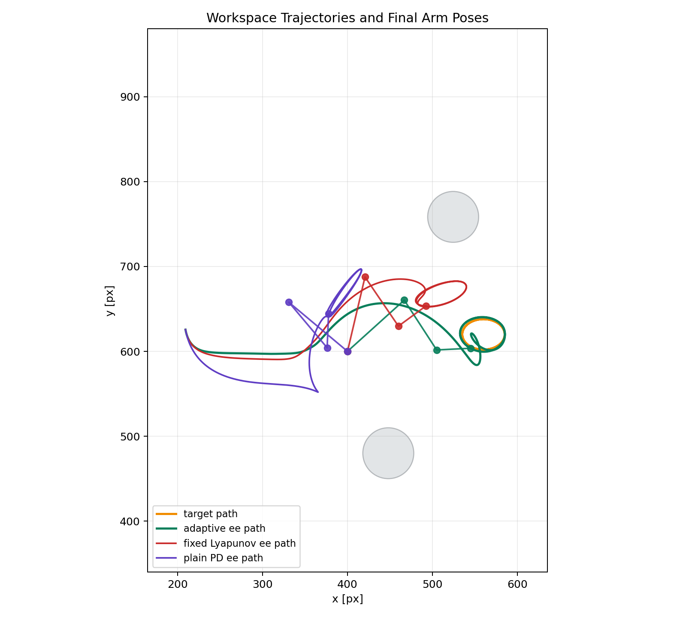
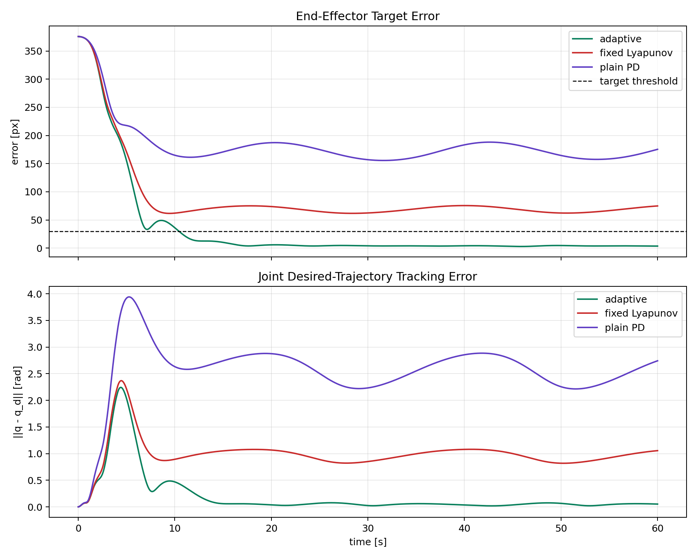
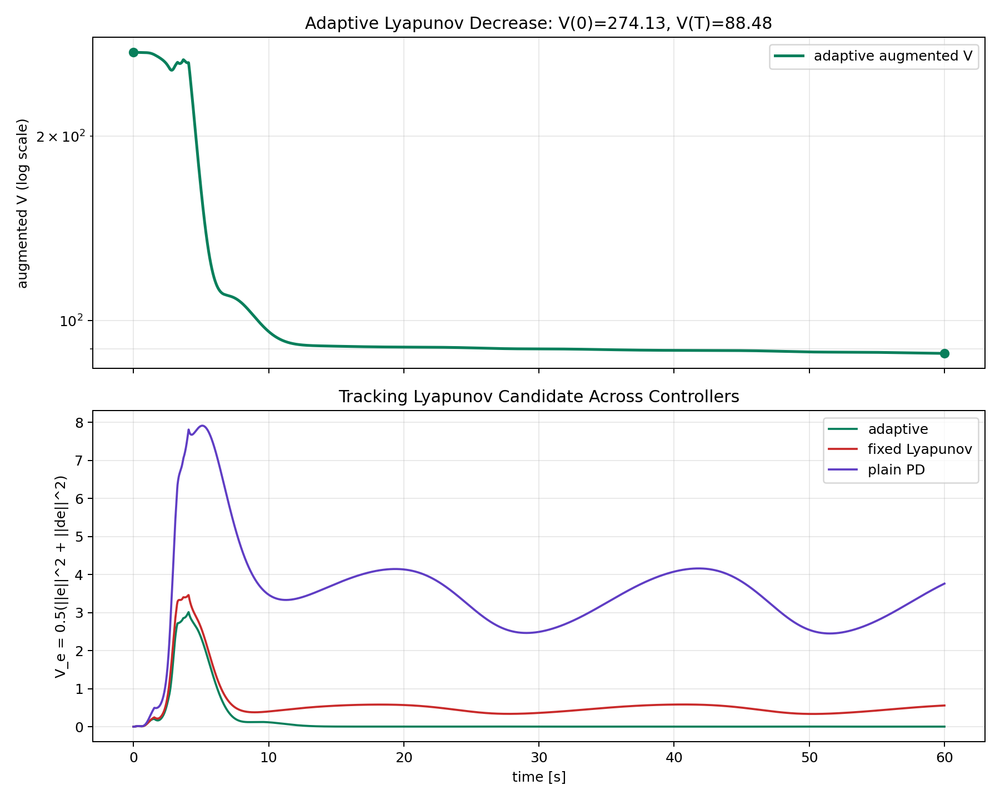
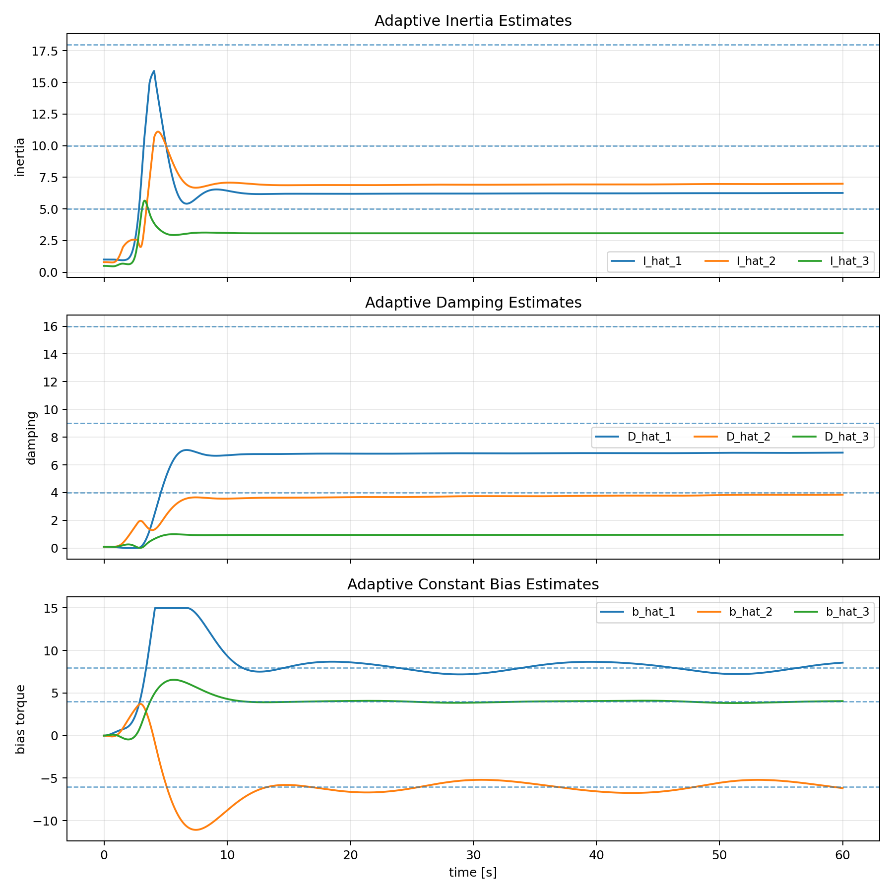
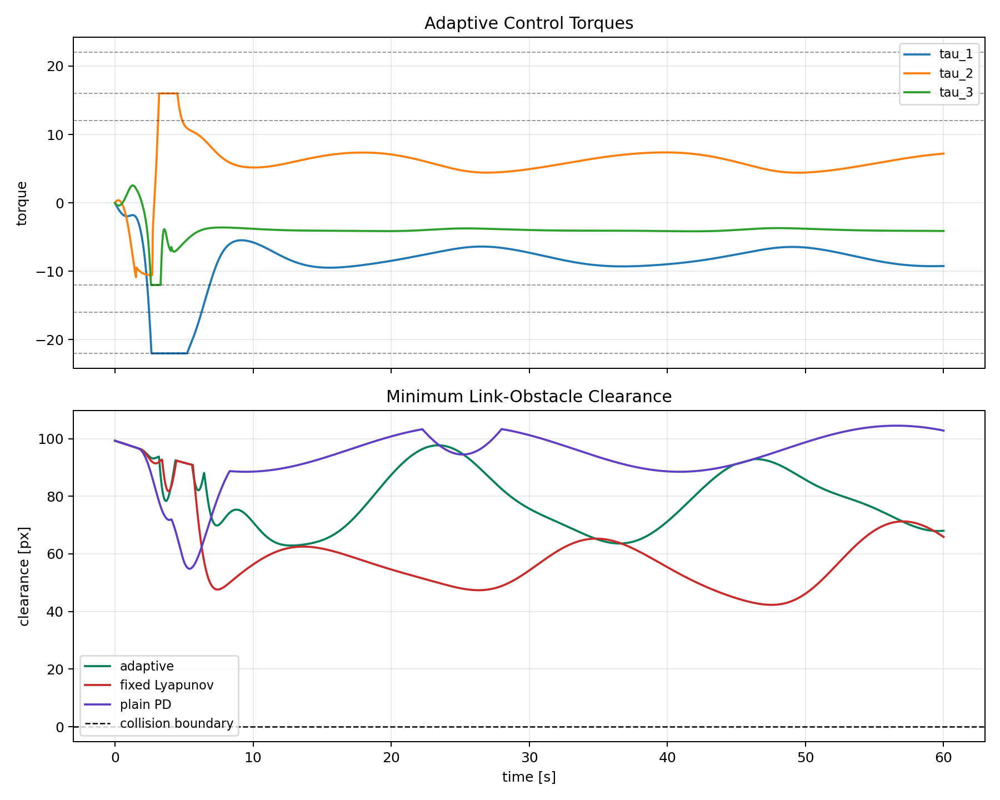
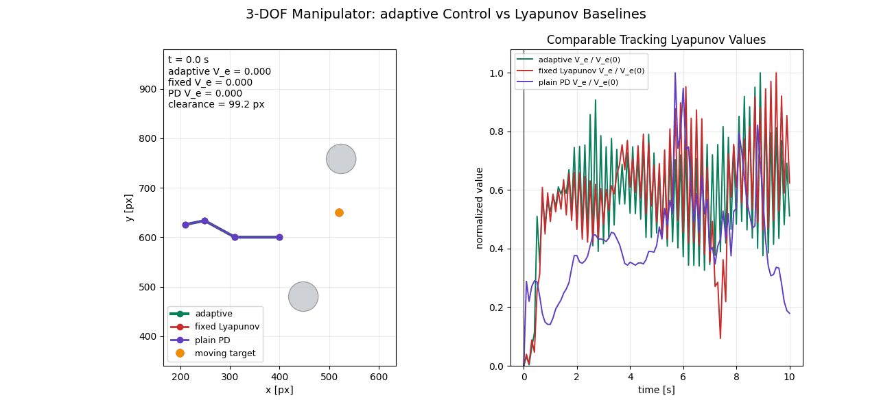

# Project 2: Adaptive Control of a 3-DOF Planar Manipulator

## Problem Definition

The project idea is taken from Team 8's repository:
https://github.com/14Og/RL-projects-team-8.

Control objective:

- move the end effector of a 3-link planar manipulator toward a moving target
- avoid moving circular obstacles
- track an obstacle-aware joint reference under unknown joint inertia and damping
- compare adaptive control against non-adaptive Lyapunov baselines

Important scope note: this implementation does not copy Team 8's code and does
not reproduce their full rigid-body `M(q), C(q, q_dot), G(q)` model. It uses a
simplified diagonal joint-space model because the adaptive-control proof from
the lecture requires dynamics that are linear in unknown constant parameters.

## System Description

The arm has three revolute joints and link lengths:

```text
L = [90, 70, 40] px
```

The base is fixed at:

```text
p_base = [400, 600] px
```

State variables:

```math
q =
\begin{bmatrix} q_1 & q_2 & q_3 \end{bmatrix}^T,
\qquad
\dot q =
\begin{bmatrix} \dot q_1 & \dot q_2 & \dot q_3 \end{bmatrix}^T.
```

Control input:

```math
\tau =
\begin{bmatrix} \tau_1 & \tau_2 & \tau_3 \end{bmatrix}^T.
```

Torque bounds:

```text
|tau| <= [22, 16, 12]
```

Forward kinematics for joint endpoint `i`:

```math
p_i(q) = p_base +
\sum_{k=1}^{i}
L_k
\begin{bmatrix}
\cos(q_1 + ... + q_k) \\
\sin(q_1 + ... + q_k)
\end{bmatrix}.
```

The end effector is `p_3(q)`.

Moving target:

```math
p_T(t) =
c_T +
\begin{bmatrix}
a_x \cos(\omega_T t) \\
a_y \sin(\omega_T t)
\end{bmatrix}.
```

Moving obstacles:

```math
c_j(t) =
c_{j,0} +
\begin{bmatrix}
A_{jx} \cos(\omega_j t + \phi_j) \\
A_{jy} \sin(\omega_j t + \phi_j)
\end{bmatrix}.
```

Each obstacle is a circle with radius `30 px`.

## Plant Dynamics

The simulated torque-level plant is:

```math
H \ddot q + D \dot q = \tau + d(t).
```

Here:

- `H = diag(H_1, H_2, H_3)` is the true joint inertia matrix
- `D = diag(D_1, D_2, D_3)` is the true viscous damping matrix
- `d(t)` is an external joint-torque term
- `H`, `D`, and the constant part of `d(t)` are unknown to the controllers

Default true parameters:

```text
H = [18, 10, 5]
D = [16, 9, 4]
```

Default external torque:

```math
d_i(t) = b_i + a_{d,i}\sin(\omega_{d,i}t),
```

with:

```text
b = [8, -6, 4]
ad = [0, 0, 0]
omega_d = [0, 0, 0]
```

This model is deliberately simpler than a full manipulator model, but it is
linear in unknown constant parameters and therefore fits the adaptive-control
theory used here.

The default experiment uses a constant unknown bias `b`, just like the
submarine illustration uses an unknown constant force bias. This is still
covered by the adaptive-control proof because `b` is included in the adaptive
parameter vector. The sinusoidal part is kept at zero; a time-varying
unmodeled disturbance would be a stress test outside the formal guarantee.

## Obstacle-Aware Reference Generator

The controller tracks a generated desired joint trajectory `q_d(t)`. The
reference generator is a kinematic artificial-potential-field planner. A
2-second smooth startup ramp is applied to the generated velocity so the
desired signal does not begin with an artificial acceleration jump.

Goal velocity in task space:

```math
v_g =
k_g (p_T - p_3(q_d)) + \dot p_T.
```

The goal contribution to joint velocity uses damped least squares:

```math
\dot q_g =
J_3(q_d)^T
\left(J_3(q_d)J_3(q_d)^T + \eta^2 I\right)^{-1}
v_g.
```

For each obstacle and each controlled point on the arm, a repulsive velocity is
added when the clearance is below an influence distance. The code converts that
repulsive point velocity to joint velocity through the corresponding point
Jacobian.

The planner is heuristic. It is included to preserve the obstacle-avoidance
problem idea from Team 8. The formal adaptive proof applies to tracking the
bounded generated reference, not to global obstacle-avoidance optimality.

## Adaptive Control Theory

The lecture uses a certainty-equivalence adaptive-control pattern:

```math
\pi(s \mid \hat\theta) =
\pi_0(s) - \Psi(s)\hat\theta,
\qquad
\dot{\hat\theta} =
\Gamma \Psi(s)^T G(s)^T \nabla L_0(s).
```

The project uses the same structure in joint space. The desired trajectory from
the planner is `q_d(t)`. The lecture-style filtered tracking error is:

```math
e = q - q_d,
\qquad
\dot e = \dot q - \dot q_d,
\qquad
s = \dot e + \lambda e.
```

The filtered reference velocity and acceleration are:

```math
\dot q_r = \dot q_d - \lambda e,
\qquad
\ddot q_r = \ddot q_d - \lambda \dot e.
```

The adaptive torque law is:

```math
\tau =
\hat H \ddot q_r
+ \hat D \dot q
- \hat b
- K_s s.
```

Because:

```math
H \dot s =
-K_s s
+ \tilde H \ddot q_r
+ \tilde D \dot q
- \tilde b,
```

where:

```math
\tilde H = \hat H - H,
\qquad
\tilde D = \hat D - D,
\qquad
\tilde b = \hat b - b,
```

use the augmented Lyapunov candidate:

```math
V =
\frac{1}{2}s^T Hs
+ \sum_i \frac{\tilde H_i^2}{2\gamma_{H_i}}
+ \sum_i \frac{\tilde D_i^2}{2\gamma_{D_i}}
+ \sum_i \frac{\tilde b_i^2}{2\gamma_{b_i}}.
```

The update laws are:

```math
\dot{\hat H}_i = -\gamma_{H_i} s_i \ddot q_{r,i},
\qquad
\dot{\hat D}_i = -\gamma_{D_i} s_i \dot q_i,
\qquad
\dot{\hat b}_i = \gamma_{b_i} s_i.
```

Equivalently, define the row regressor
`Y_i = [ddot q_{r,i}, dot q_i, -1]` and the parameter vector
`theta_i = [H_i, D_i, b_i]^T`. Then the model compensation is `Y_i hat theta_i` and
the update is `dot hat theta_i = -Gamma_i Y_i^T s_i`. This is the lecture
formula with `Psi = -Y` and `G^T grad L_0 = s`.

Notation mapping to the code:

| Lecture/report symbol | Code signal |
|---|---|
| `q_d`, `dot q_d`, `ddot q_d` | `ReferenceState.q`, `ReferenceState.dq`, `ReferenceState.ddq` |
| `s` | `ControlInfo.sliding_error` |
| `dot q_r`, `ddot q_r` | `ControlInfo.dq_r`, `ControlInfo.ddq_r` |
| `hat H`, `hat D`, `hat b` | `ControlInfo.inertia_hat`, `ControlInfo.damping_hat`, `ControlInfo.bias_hat` |
| `Gamma` | `gamma_inertia`, `gamma_damping`, `gamma_bias` in `configs/default.json` |

Substitution gives:

```math
\dot V = -s^T K_s s <= 0.
```

Under the standard lecture assumptions of bounded reference signals, positive
inertia, no actuator saturation, and exact velocity measurement, the filtered
error `s` converges to zero. Since `s = dot e + lambda e` is a stable first
order filter, `e -> 0` and `dot e -> 0`.

Parameter convergence is not guaranteed without persistent excitation. The
results therefore focus on tracking improvement, not exact identification.

This adaptive controller handles unknown constant inertia, damping, and torque
bias because all three appear linearly in the regressor. It is not, by this
proof, a general time-varying-disturbance compensator. A time-varying or
non-parameterized disturbance would require a robust/sliding term, leakage, or a
disturbance observer.

## Comparison Controllers

### Fixed Lyapunov Baseline

The fixed baseline uses the same filtered-error structure but keeps incorrect
inertia/damping parameters and does not estimate the constant bias:

```math
\tau =
H_0 \ddot q_r
+ D_0 \dot q
- K_s s.
```

Defaults:

```text
H_0 = [1.0, 0.8, 0.5]
D_0 = [0.1, 0.1, 0.1]
K_s = [8, 6, 4]
```

This is the nominal failing controller in the default experiment. The sliding
gain is not artificially weakened; it matches the adaptive controller. The
failure comes from the same mechanism as the first submarine example: a
constant unknown bias is present, the nominal controller ignores it, and a
steady tracking error remains. The adaptive controller starts from the same
poor inertia/damping estimates and zero bias estimate, then updates them online.

### Plain PD Lyapunov Baseline

The second baseline is classical joint-space PD tracking:

```math
\tau = -K_p e - K_d \dot e.
```

This is a simple Lyapunov controller for joint errors, but it has no adaptive
model compensation.

## Algorithm Listing

For each simulation step:

1. Compute the moving target `p_T(t)` and moving obstacles `c_j(t)`.
2. Update the obstacle-aware desired trajectory `q_d, dot q_d, ddot q_d`.
3. Measure the plant state `q, dot q`.
4. Compute `e = q - q_d`, `dot e = dot q - dot q_d`.
5. Compute `s = dot e + lambda e`.
6. Compute `dot q_r = dot q_d - lambda e` and `ddot q_r = ddot q_d - lambda dot e`.
7. Apply adaptive torque:
   `tau = H_hat ddot q_r + D_hat dot q - b_hat - K_s s`.
8. Update `H_hat`, `D_hat`, and `b_hat` using the adaptive laws.
9. Clip torque to the configured actuator limits.
10. Integrate the true plant dynamics.
11. Record target error, joint error, torque, parameter estimates, and obstacle clearance.

The fixed Lyapunov baseline skips step 8 and has `b_hat = 0`. The PD baseline
uses its own torque law in step 7.

## Project Structure

```text
.
|-- README.md
|-- requirements.txt
|-- main.py
|-- configs/
|   `-- default.json
|-- figures/
|-- animations/
`-- src/
    |-- __init__.py
    |-- config.py
    |-- system.py
    |-- controller.py
    |-- simulation.py
    |-- visualization.py
    `-- main.py
```

Separation:

- `system.py`: kinematics, obstacles, dynamics, collision clearance
- `controller.py`: reference generator and controllers
- `simulation.py`: rollout and metrics
- `visualization.py`: plots and animation only
- `main.py`: command-line orchestration

## Experimental Setup

Default setup:

| Quantity | Value |
|---|---:|
| duration | 60 s |
| integration step | 0.02 s |
| initial angles | `[pi, -0.5, 0.7]` rad |
| target threshold | 30 px |
| obstacle radius | 30 px |
| true inertia | `[18, 10, 5]` |
| true damping | `[16, 9, 4]` |
| constant torque bias | `[8, -6, 4]` |
| disturbance amplitude | `[0, 0, 0]` |
| reference startup ramp | 2 s |
| initial inertia estimate | `[1.0, 0.8, 0.5]` |
| initial damping estimate | `[0.1, 0.1, 0.1]` |
| initial bias estimate | `[0, 0, 0]` |
| adaptive/fixed sliding gain | `[8, 6, 4]` |
| torque limits | `[22, 16, 12]` |

The default experiment uses no time-varying disturbance. The nonzero constant
bias is part of the unknown parameter vector and is estimated by the adaptive
controller.

## Reproducibility

Install:

```bash
pip install -r requirements.txt
```

Run the complete experiment:

```bash
python main.py
```

Run without animation:

```bash
python main.py --no-animation
```

Run a shorter smoke test:

```bash
python main.py --duration 5 --no-plots --no-animation
```

Equivalent module entry point:

```bash
python -m src.main
```

Produced outputs:

- `figures/summary_metrics.json`
- `figures/rollout_timeseries.csv`
- `figures/workspace_trajectories.png`
- `figures/tracking_errors.png`
- `figures/lyapunov_values.png`
- `figures/adaptive_parameter_estimates.png`
- `figures/control_and_clearance.png`
- `animations/adaptive_manipulator.gif`

The CSV file stores synchronized samples for all controllers, including
`q_d`, `dot q_d`, the lecture filtered signals `dot q_r`, `ddot q_r`, torques,
clearance, saturation flags, Lyapunov values, and parameter estimates including
`hat b`.

## Results Summary

Default run metrics:

| Controller | Tail mean target error | Minimum clearance | Tail success | Collisions |
|---|---:|---:|---:|---:|
| adaptive | 3.969 px | 62.878 px | 1.000 | 0 |
| fixed Lyapunov | 67.322 px | 42.292 px | 0.000 | 0 |
| plain PD | 162.433 px | 54.814 px | 0.000 | 0 |

The adaptive controller tracks the generated reference tightly and keeps
positive obstacle clearance. The frozen fixed-parameter Lyapunov baseline is
the failure case: even with the same sliding gain as adaptive control, it misses
the 30 px target threshold during the whole final window because it cannot
cancel the constant torque bias. Plain PD also fails under the same bias.

The comparable tracking Lyapunov candidate `V_e` also favors adaptive control:
the tail mean `V_e` is `0.00127` for adaptive control, `0.43142` for the fixed
Lyapunov baseline, and `2.90878` for plain PD. The animation now shows this same
`V_e` quantity for all three controllers.

The adaptive augmented Lyapunov value decreases from `274.13` to `88.48` in
the default run. The final bias estimate is `[8.57, -6.18, 4.05]`, close to the
true bias `[8, -6, 4]`. The largest local positive numerical step is `0.596`;
the small non-monotone samples come from discrete-time integration, projection,
and actuator clipping, while the overall trend matches the lecture Lyapunov
argument. This augmented value includes both filtered tracking error and
parameter-estimation error, including bias-estimation error, so it is not
directly comparable to PD or fixed Lyapunov tracking energy.

The final adaptive estimates are not equal to the true physical parameters.
This is expected: the lecture theory guarantees tracking under the stated
assumptions, while parameter convergence additionally requires persistent
excitation.

## Final Artifacts



Figure 1. End-effector paths, moving target path, obstacles at the initial
frame, and final arm configurations.



Figure 2. End-effector target error and desired-trajectory tracking error. The
dashed line marks the 30 px target threshold; the fixed Lyapunov baseline stays
above it in the final window, while adaptive control tracks below it.



Figure 3. The top panel shows the adaptive augmented Lyapunov function
decreasing overall in the default constant-bias run. The bottom panel compares
the same simpler tracking Lyapunov candidate across controllers.



Figure 4. Online inertia, damping, and constant-bias estimates. Dashed lines
mark true values. The bias estimate converges close to the true bias; inertia
and damping estimates improve tracking but do not exactly identify all
parameters.



Figure 5. Adaptive torques and minimum link-obstacle clearance. In this
constant-bias scenario the fixed Lyapunov baseline fails by missing the target,
while all methods remain collision-free.

Animation:



## Limitations

- The dynamics are diagonal joint-space dynamics, not the full rigid-body model
  from Team 8.
- The obstacle-aware planner is heuristic APF plus damped least squares. It is
  not a formal CBF safety proof.
- The Lyapunov proof ignores actuator saturation; the implementation records
  saturation so this limitation is visible.
- Arbitrary time-varying disturbance is a stress test, not part of the current
  proof. The default constant bias is covered because it is parameterized in the
  regressor; a non-parameterized disturbance would require a robust term or a
  disturbance observer.
- No sensor noise is simulated. A real noisy system would need projection,
  leakage, dead zones, or filtering to avoid parameter drift.
